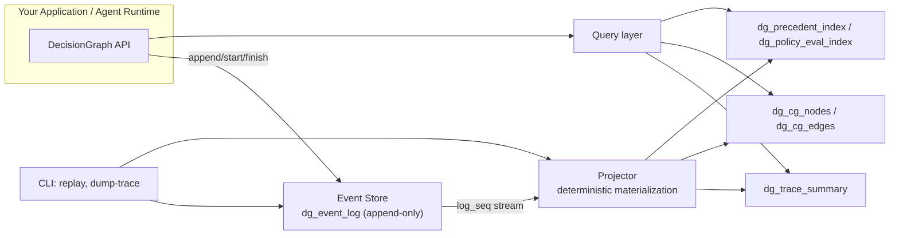
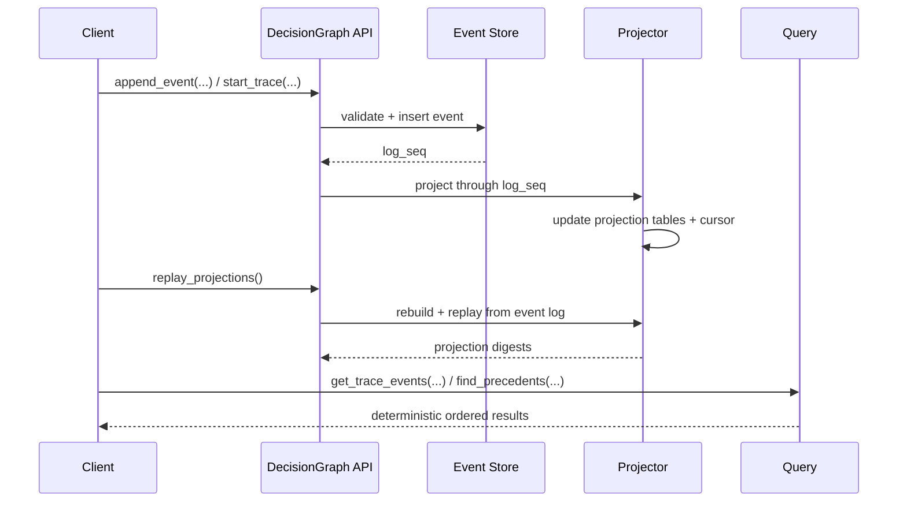

# DecisionGraph

Deterministic, append-only decision audit trails for AI agents and automation systems.

[](https://github.com/aliuyar1234/DecisionGraph/actions/workflows/ci.yml)
[](https://github.com/aliuyar1234/DecisionGraph/actions/workflows/demo.yml)
[](https://github.com/aliuyar1234/DecisionGraph/actions/workflows/security.yml)
[](https://github.com/aliuyar1234/DecisionGraph/actions/workflows/performance.yml)
[](https://app.codecov.io/github/aliuyar1234/decisiongraph)
[](https://aliuyar1234.github.io/DecisionGraph/)
[](LICENSE)
[](https://www.python.org/)

## Why DecisionGraph

When an agent makes a decision, teams need three things:

- A complete, immutable record of what happened.
- A clear explanation path (inputs, policy outcomes, approvals, actions).
- Reproducibility guarantees that hold across replays and environments.

DecisionGraph is a local-first library that provides exactly this with deterministic event storage, projection rebuilds, and query surfaces for trace, graph, and precedent retrieval.

## V1 Scope

DecisionGraph v1 is intentionally limited to:

- Append-only decision event log.
- Deterministic projections and replay digests.
- Query APIs for traces, context graph, and precedents.
- Local backends: SQLite and PostgreSQL.
- Read-only inspection CLI.

Not in scope: workflow orchestration, policy execution engines, hosted SaaS control plane.

## Architecture

### System Topology



### Replay and Query Lifecycle



## Quickstart

### Installation

```bash
git clone https://github.com/aliuyar1234/DecisionGraph.git
cd DecisionGraph
uv sync

# Optional PostgreSQL backend support
uv sync --extra postgres
```

### Minimal Example

```python
from decisiongraph import DecisionGraph
from decisiongraph.domain.types import ActorRef, EntityRef, SourceRef

dg = DecisionGraph(":memory:")

source = SourceRef(producer_id="renewal-agent", system="agent-platform")
actor = ActorRef(actor_type="agent", actor_id="renewal-v1")
primary = EntityRef(entity_type="account", entity_id="acct-123", system="crm")

trace_id = dg.start_trace(
    workflow="renewal",
    title="Discount review for acct-123",
    primary_entity=primary,
    source=source,
    actor=actor,
)

dg.finish_trace(trace_id, outcome="success", source=source, actor=actor)
events = dg.get_trace_events(trace_id)
print(f"trace={trace_id} events={len(events)}")

dg.close()
```

## CLI

```bash
# Rebuild projections and print deterministic digests
python -m decisiongraph replay sample.db

# Dump trace events as JSON (safe output mode)
python -m decisiongraph dump-trace sample.db trace-123

# Include payload + full metadata explicitly
python -m decisiongraph dump-trace sample.db trace-123 --include-payload
```

## Demo and Smoke Checks

```bash
# End-to-end showcase artifact
uv run python demo/run_demo.py --db demo/showcase.db --output demo/showcase_output.md --force

# Deterministic demo + CLI smoke checks
uv run python scripts/demo_smoke_check.py --artifact-dir .tmp/demo-smoke

# Validate README/demo CLI snippets
uv run python scripts/docs_snippets_check.py --artifact-dir .tmp/docs-snippets
```

### Local LLM Profile (Ollama)

```bash
# CI-safe profile: gracefully writes a skip report if Ollama/model is unavailable
uv run python demo/run_llm_demo.py --backend ollama --ollama-model qwen2.5:0.5b --skip-if-unavailable
```

## Guarantees

- Append-only event log ordering (`log_seq`, `trace_seq`).
- Idempotency enforcement with metadata consistency checks.
- Deterministic projection digests for replay verification.
- Crash-recovery coverage for append/projection boundaries.
- Contract tests for stable public API and CLI surface.

## Performance and Quality Gates

- Coverage gate enforced in CI (`--cov-fail-under=75`).
- Security CI: dependency audit + secret scan baseline policy.
- Performance CI:
  - Quick guardrails on push/PR.
  - Full 1k/10k/100k scaling run on schedule/manual trigger.
- Flaky-rate guard: repeated-run stability checks in CI.

## Documentation

- Full docs: https://aliuyar1234.github.io/DecisionGraph/
- V1 contracts: [docs/v1-contracts.md](docs/v1-contracts.md)
- Release checklist: [docs/release.md](docs/release.md)
- Operations runbook: [docs/operations.md](docs/operations.md)

## Development

```bash
uv sync --extra dev
uv run ruff check src demo scripts tests
uv run mypy src
uv run lint-imports
uv run pytest -q
```

## Repository Layout

```text
src/decisiongraph/
  api.py              # public facade
  domain/             # event and validation models
  storage/            # SQLite and PostgreSQL backends
  projections/        # deterministic materialized views + digests
  query/              # trace/graph/precedent query APIs

tests/
  unit/
  integration/
  e2e/
  golden/
```

## Contributing and Security

- Contributing guide: [CONTRIBUTING.md](CONTRIBUTING.md)
- Code of conduct: [CODE_OF_CONDUCT.md](CODE_OF_CONDUCT.md)
- Security policy: [SECURITY.md](SECURITY.md)
- Issues: https://github.com/aliuyar1234/DecisionGraph/issues
- Discussions: https://github.com/aliuyar1234/DecisionGraph/discussions

## License

Apache-2.0
