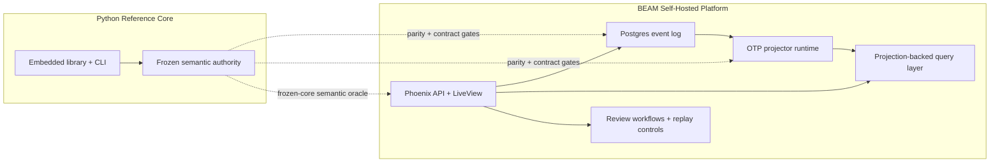

# DecisionGraph

Deterministic decision audit trails, operator workflows, and replay verification for AI agents and automation systems.

[](https://github.com/aliuyar1234/DecisionGraph/actions/workflows/ci.yml)
[](https://github.com/aliuyar1234/DecisionGraph/releases)
[](https://aliuyar1234.github.io/DecisionGraph/)
[](docs/operations/SELF_HOSTED_INSTALL.md)
[](LICENSE)
[](https://www.python.org/)

## Why DecisionGraph

When an agent makes a decision, teams need three things:

- A complete, immutable record of what happened.
- A clear explanation path (inputs, policy outcomes, approvals, actions).
- Reproducibility guarantees that hold across replays and environments.

DecisionGraph is a local-first platform with two deliberate surfaces:

- the Python package remains the frozen semantic reference and local embedded library
- the BEAM umbrella is the self-hosted runtime with APIs, projections, operator console, workflows, and replay controls

That split is intentional. Python preserves the semantic oracle, while BEAM owns the long-running system behavior.

## Architecture

DecisionGraph has one product and two deliberate implementation surfaces:

- `Python reference core` in `src/decisiongraph`: frozen semantic authority for the Phase 1 event model, local embedded library, reference CLI, golden fixtures, and parity oracle
- `BEAM self-hosted platform` in `beam/`: OTP runtime with Postgres event store, projection workers, authenticated API, LiveView operator console, review workflows, replay controls, and release packaging

Phase 9 locked that boundary in on purpose: Python remains the semantic authority for the frozen core, while BEAM owns the long-running product runtime. The BEAM side is not a thin wrapper around Python; it is the self-hosted platform, with parity gates proving it stays aligned to the reference semantics.



Practical reading of that split:

- use Python when you want local embedded/reference behavior
- use BEAM when you want the self-hosted service, operator console, workflows, and replay operations
- the two sides share contracts and parity evidence, but Python does not silently proxy into BEAM

## V1 Scope

DecisionGraph v1 is intentionally focused on:

- append-only decision event log
- deterministic projections and replay digests
- trace, graph, precedent, health, and replay APIs
- LiveView operator console and human review workflows
- self-hosted single-node BEAM runtime with PostgreSQL
- Python reference library for the frozen semantic core

Not in scope for the first serious release:

- hosted SaaS
- clustered multi-node deployment

Packaging paths now available in the repo:

- buildable OTP release via `mix release decisiongraph_beam`
- buildable BEAM container image via `beam/Dockerfile` after the release is built
- optional source-building container path via `beam/Dockerfile.build`

## Fastest Self-Hosted Demo

From the repository root:

```bash
docker compose up postgres otel-collector -d
cd beam
mix setup
set PHX_SERVER=true
iex -S mix
```

In a second terminal:

```bash
cd beam
mix dg.demo.seed --output ../.tmp/phase10-demo-report.json
```

Then open the seeded operator console routes:

- `http://localhost:4100/?tenant=release-demo&trace_id=trace-live-renewal-002&workflow_id=trace-live-renewal-002:exception:ex-live-renewal-002`
- `http://localhost:4100/?tenant=release-demo&trace_id=trace-incident-review-003&workflow_id=trace-incident-review-003:trace_review:incident_triage`

The seeded release demo gives you:

- an approved precedent trace
- a live escalated exception review
- an incident review workflow launched from a trace investigation
- projection health, replay controls, workflow export, and operator-console investigation paths

To validate the whole release candidate path in one command:

```bash
cd beam
mix dg.release.validate --output ../.tmp/phase10-release-validation.json
```

Generate a rotate-friendly bootstrap file for a self-hosted install:

```bash
cd beam
mix dg.accounts.bootstrap --output ../.tmp/service-accounts.json
```

Build the packaged BEAM release:

```bash
cd beam
mix release decisiongraph_beam
```

## BEAM Runtime

The self-hosted BEAM apps are:

- `dg_domain`
- `dg_store`
- `dg_projector`
- `dg_api`
- `dg_web`
- `dg_observability`

Local bootstrap:

```bash
docker compose up postgres otel-collector -d
cd beam
mix setup
mix test
```

Self-hosted BEAM operator guides:

- [docs/architecture/SELF_HOSTED_TOPOLOGY.md](docs/architecture/SELF_HOSTED_TOPOLOGY.md)
- [docs/architecture/SINGLE_NODE_RECOVERY.md](docs/architecture/SINGLE_NODE_RECOVERY.md)
- [docs/operations/SELF_HOSTED_INSTALL.md](docs/operations/SELF_HOSTED_INSTALL.md)
- [docs/operations/BACKUP_AND_RESTORE.md](docs/operations/BACKUP_AND_RESTORE.md)
- [docs/operations/UPGRADE_AND_ROLLBACK.md](docs/operations/UPGRADE_AND_ROLLBACK.md)
- [docs/operations/DISASTER_RECOVERY.md](docs/operations/DISASTER_RECOVERY.md)
- [docs/operations/SELF_HOSTED_RELEASE_CHECKLIST.md](docs/operations/SELF_HOSTED_RELEASE_CHECKLIST.md)
- [docs/benchmarks/PHASE_8_CAPACITY_MODEL.md](docs/benchmarks/PHASE_8_CAPACITY_MODEL.md)
- [docs/benchmarks/PHASE_8_RESILIENCE_BASELINE.md](docs/benchmarks/PHASE_8_RESILIENCE_BASELINE.md)

Release-candidate and platform evidence:

```bash
cd beam
mix dg.demo.seed --output ../.tmp/phase10-demo-report.json
mix dg.release.validate --output ../.tmp/phase10-release-validation.json
```

Quality gates:

```bash
cd beam
mix format --check-formatted
mix credo --strict
mix dialyzer
mix test
```

Run the Phoenix shell:

```bash
cd beam
set PHX_SERVER=true
iex -S mix
```

## Quickstart

### Installation

```bash
git clone https://github.com/aliuyar1234/DecisionGraph.git
cd DecisionGraph
uv sync

# Optional PostgreSQL backend support
uv sync --extra postgres
```

### Python Reference Example

```python
from decisiongraph import DecisionGraph
from decisiongraph.domain.types import ActorRef, EntityRef, PolicyRef, SourceRef

dg = DecisionGraph(":memory:")

source = SourceRef(producer_id="renewal-agent", system="agent-platform")
actor = ActorRef(actor_type="agent", actor_id="renewal-v1")
primary = EntityRef(entity_type="account", entity_id="acct-123", system="crm")

trace_id = dg.start_trace(
    workflow="renewal",
    title="Discount review for acct-123",
    primary_entity=primary,
    source=source,
    actor=actor,
)

dg.evaluate_policy(
    trace_id=trace_id,
    policy=PolicyRef(policy_id="discount-cap", policy_version="1.0"),
    inputs=[],
    decision="allow",
    source=source,
    actor=actor,
)
dg.finish_trace(trace_id, outcome="success", source=source, actor=actor)
events = dg.get_trace_events(trace_id)
print(f"trace={trace_id} events={len(events)}")

dg.close()
```

## CLI

```bash
# Replay events into temporary projection state and print deterministic digests
python -m decisiongraph replay sample.db

# Inspect projection cursor lag and current health
python -m decisiongraph projection-status sample.db

# Include digests for the current on-disk projection state
python -m decisiongraph projection-status sample.db --include-digests

# Dump trace events as JSON (safe output mode)
python -m decisiongraph dump-trace sample.db trace-123

# Include payload + full metadata explicitly
python -m decisiongraph dump-trace sample.db trace-123 --include-payload
```

## Demo and Smoke Checks

BEAM self-hosted release demo:

```bash
docker compose up postgres otel-collector -d
cd beam
mix setup
mix dg.demo.seed --output ../.tmp/phase10-demo-report.json
mix dg.release.validate --output ../.tmp/phase10-release-validation.json
```

Python reference demo:

```bash
# End-to-end showcase artifact
uv run python demo/run_demo.py --db demo/showcase.db --output demo/showcase_output.md --force

# Deterministic demo + CLI smoke checks
uv run python scripts/demo_smoke_check.py --artifact-dir .tmp/demo-smoke

# Validate README/demo CLI snippets
uv run python scripts/docs_snippets_check.py --artifact-dir .tmp/docs-snippets
```

### Local LLM Profile (Ollama)

```bash
# CI-safe profile: gracefully writes a skip report if Ollama/model is unavailable
uv run python demo/run_llm_demo.py --backend ollama --ollama-model qwen2.5:0.5b --skip-if-unavailable
```

## Guarantees

- Append-only event log ordering (`log_seq`, `trace_seq`).
- Idempotency enforcement with metadata consistency checks.
- Deterministic projection digests for replay verification.
- Crash-recovery coverage for append/projection boundaries.
- Contract tests for stable public API and CLI surface.

## Performance and Quality Gates

- Coverage gate enforced in CI (`--cov-fail-under=75`).
- Security CI: dependency audit + secret scan baseline policy.
- Performance CI:
  - Quick guardrails on push/PR.
  - Full 1k/10k/100k scaling run on schedule/manual trigger.
- Flaky-rate guard: repeated-run stability checks in CI.

## Documentation

- Full docs: https://aliuyar1234.github.io/DecisionGraph/
- Showcase walkthrough: [docs/showcase.md](docs/showcase.md)
- V1 contracts: [docs/v1-contracts.md](docs/v1-contracts.md)
- Release checklist: [docs/release.md](docs/release.md)
- Operations runbook: [docs/operations.md](docs/operations.md)
- Self-hosted install: [docs/operations/SELF_HOSTED_INSTALL.md](docs/operations/SELF_HOSTED_INSTALL.md)
- Backup and restore: [docs/operations/BACKUP_AND_RESTORE.md](docs/operations/BACKUP_AND_RESTORE.md)
- Upgrade and rollback: [docs/operations/UPGRADE_AND_ROLLBACK.md](docs/operations/UPGRADE_AND_ROLLBACK.md)
- Disaster recovery: [docs/operations/DISASTER_RECOVERY.md](docs/operations/DISASTER_RECOVERY.md)
- Self-hosted release checklist: [docs/operations/SELF_HOSTED_RELEASE_CHECKLIST.md](docs/operations/SELF_HOSTED_RELEASE_CHECKLIST.md)
- BEAM umbrella guide: [beam/README.md](beam/README.md)
- BEAM supervision tree: [docs/architecture/BEAM_SUPERVISION_TREE.md](docs/architecture/BEAM_SUPERVISION_TREE.md)
- BEAM process ownership: [docs/architecture/BEAM_PROCESS_OWNERSHIP.md](docs/architecture/BEAM_PROCESS_OWNERSHIP.md)
- BEAM store contract: [docs/architecture/BEAM_STORE_CONTRACT.md](docs/architecture/BEAM_STORE_CONTRACT.md)
- Phoenix platform architecture: [docs/architecture/DECISIONGRAPH_PHOENIX_ARCHITECTURE.md](docs/architecture/DECISIONGRAPH_PHOENIX_ARCHITECTURE.md)
- Self-hosted topology: [docs/architecture/SELF_HOSTED_TOPOLOGY.md](docs/architecture/SELF_HOSTED_TOPOLOGY.md)
- Single-node recovery: [docs/architecture/SINGLE_NODE_RECOVERY.md](docs/architecture/SINGLE_NODE_RECOVERY.md)
- Storage lifecycle: [docs/architecture/STORAGE_LIFECYCLE.md](docs/architecture/STORAGE_LIFECYCLE.md)
- Planning overview: [docs/plans/index.md](docs/plans/index.md)
- BEAM master plan: [docs/plans/DECISIONGRAPH_BEAM_MASTERPLAN.md](docs/plans/DECISIONGRAPH_BEAM_MASTERPLAN.md)
- Phase 3 benchmark baseline: [docs/benchmarks/PHASE_3_STORE_BASELINE.md](docs/benchmarks/PHASE_3_STORE_BASELINE.md)
- Phase 8 capacity model: [docs/benchmarks/PHASE_8_CAPACITY_MODEL.md](docs/benchmarks/PHASE_8_CAPACITY_MODEL.md)
- Phase 8 resilience baseline: [docs/benchmarks/PHASE_8_RESILIENCE_BASELINE.md](docs/benchmarks/PHASE_8_RESILIENCE_BASELINE.md)
- Phase 10 release validation: [docs/benchmarks/PHASE_10_RELEASE_VALIDATION.md](docs/benchmarks/PHASE_10_RELEASE_VALIDATION.md)

## Development

```bash
uv sync --extra dev
uv run ruff check src demo scripts tests
uv run mypy src
uv run lint-imports
uv run pytest -q
```

## Repository Layout

```text
src/decisiongraph/
  api.py              # public facade
  domain/             # event and validation models
  storage/            # SQLite and PostgreSQL backends
  projections/        # deterministic materialized views + digests
  query/              # trace/graph/precedent query APIs

tests/
  unit/
  integration/
  e2e/
  golden/
```

## Contributing and Security

- Contributing guide: [CONTRIBUTING.md](CONTRIBUTING.md)
- Code of conduct: [CODE_OF_CONDUCT.md](CODE_OF_CONDUCT.md)
- Security policy: [SECURITY.md](SECURITY.md)
- Issues: https://github.com/aliuyar1234/DecisionGraph/issues
- Discussions: https://github.com/aliuyar1234/DecisionGraph/discussions

## License

Apache-2.0
