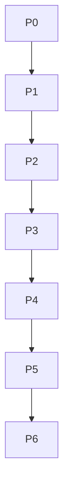

# DecisionGraph — SPEC.md (SSOT)

Version: 1.0.3-minpatch (SSOT)  
Status: FROZEN-DECISIONS aktiv (siehe Abschnitt 4)  
Lizenz: Apache-2.0 (siehe DD-002)

---

## 1) Problem, Zielgruppe, Non-Goals

### 1.1 Problemstatement

Unternehmen betreiben Workflows über viele Systeme hinweg (CRM, Support, Billing, Incident-Management, Chat/Collab). In diesen Workflows entstehen Entscheidungen, die nicht als Daten persistiert werden: Ausnahmen, Overrides, Präzedenzfälle, Approval-Ketten und die konkrete Cross-System-Begründung.  
Diese **Decision Traces** existieren heute häufig nur in Slack-Threads, Zoom-Calls, Eskalationsgesprächen und in Köpfen.

AI/Agent-Systeme sind **cross-system** und **action-oriented**. Sie benötigen nicht nur Regeln (“was sollte generell passieren”), sondern **nachvollziehbare, abfragbare Decision Traces** (“was ist in diesem konkreten Fall passiert und warum war es erlaubt”), inklusive:
- welche Inputs aus welchen Systemen zum Entscheidzeitpunkt vorlagen,
- welche Policy (inkl. Version) evaluiert wurde,
- welche Ausnahme-Route gewählt wurde,
- wer genehmigt hat (und warum),
- welcher Commit in ein Zielsystem geschrieben wurde,
- welcher Präzedenzfall zitiert wurde.

**DecisionGraph** MUST diese fehlende Schicht als System-of-Record für Entscheidungen bereitstellen: append-only Event Log als SSOT, plus deterministische Projections (Context Graph, Precedent Search, Reports), reproduzierbar via Replay.

### 1.2 Value Proposition (normativ, ohne Marketing)

DecisionGraph MUST ein **System of Record für Entscheidungen** sein (nicht für Objekte).  
DecisionGraph MUST primär **Decision-Time Retrieval** ermöglichen: Agents und Workflows MUST vor und während einer Entscheidung Präzedenzfälle, Policy-Anwendungen, Exceptions, Approvals und die konkrete Cross-System-Kontextlage abfragen können. Post-hoc Audit ist ein Nebenprodukt und MUST NOT der primäre Design-Treiber sein.

DecisionGraph MUST:
1. Decision Traces als **append-only Events** persistieren (SSOT).
2. Aus Events deterministische Projections erzeugen (Context Graph + Precedent Index).
3. Replay-basierte Reproduzierbarkeit garantieren (gleiche Events → gleiche Projections, gleiche Digests).
4. Eine Query-API bereitstellen, die in **laufenden** Entscheidungen genutzt werden kann (precedents/policies/approvals) und zusätzlich “Warum haben wir das getan?” beantwortet.
5. Framework-agnostisch im **Write-Path** instrumentierbar sein (Hook Contracts; keine Orchestrator-Fanfiction).
6. Für Visualisierung/Exploration nur **UI-agnostische Query-Contracts** liefern (keine UI-Abhängigkeiten; siehe Abschnitt „DecisionGraph Explorer & Visual Semantics“).

### 1.2.1 Autonomy Feedback Loop (normativ)

DecisionGraph MUST den folgenden Feedback Loop als Kernsemantik unterstützen:

`Decision → Trace (append-only) → Projections wachsen → Runtime Query (Agents/Humans) → bessere/konstantere Decision → Trace → …`

**Normative Regeln (MUST):**
- Jede automatisierte oder human-in-the-loop Entscheidung, die vom System beeinflusst wird, MUST als Decision Trace erfasst werden (TraceStarted … TraceFinished).
- Jede erfasste Trace MUST deterministisch in Projections überführt werden, sodass sie als Präzedenzfall abfragbar wird.
- Runtime Query MUST auf stabilen Snapshots basieren können (via `until_log_seq` bzw. explizitem Snapshot-Cursor), damit Agents/Explorer konsistente Ergebnisse erhalten.
- Eine Trace MUST die **Begründungskette** als strukturierte Events enthalten (Inputs → PolicyEvaluation → Exception/Approval → Action), nicht nur das Endresultat im Zielsystem.


### 1.3 Zielgruppen / Personas + konkrete Workflows

DecisionGraph richtet sich an Teams, die Entscheidungen **systemübergreifend** treffen oder automatisieren und deren Output in Zielsysteme schreiben (CRM/ERP/Support/Incident/IAM/etc.). DecisionGraph MUST dort instrumentierbar sein, wo Entscheidungen **committed** werden (Write-Path am Commit-Zeitpunkt).

#### 1.3.1 Enterprise Use Case Klassen (MUST support)

DecisionGraph MUST für mindestens diese Use-Case-Klassen modellierbar und abfragbar sein (keine CRM-Spezialisierung):

1. **Deal Desk / Quote-to-Cash Overrides**: Discounts, Overrides, Ausnahmen zu Pricing-Policies, Approval-Ketten außerhalb des CRM.
2. **Support Escalations & Incident Management**: Eskalation basierend auf Cross-System-Synthese (CRM-Tier, Tickets, Incidents, Churn-Risiko).
3. **Compliance / Risk Exceptions**: Ausnahmegenehmigungen, Compliance-Reviews, “it depends”-Entscheidungen mit nachvollziehbarer Approval-Chain.
4. **Underwriting / Risk Decisions (exception-heavy)**: Entscheidungen, bei denen Präzedenz und Ausnahme-Logik zentral sind.
5. **Security Approvals & Access/Change Exceptions (Security Ops)**: approvals/overrides zwischen IT/Engineering/Compliance (glue function), inklusive Begründung und Approver.
6. **Procurement / Finance Overrides**: Spend-/Vendor-/Reconciliation-Ausnahmen, die nicht im Ledger/ERP als “Warum” auftauchen.
7. **SRE / Production Engineering**: Incident-Triage, Support→Engineering Kontext, Präzedenz für “warum ist das gebrochen / ist das erlaubt”.

#### 1.3.2 Personas (MUST support)

**Personas (MUST support):**
- **Deal Desk / RevOps**
- **Support Ops / Escalation Management**
- **Compliance / Risk Review**
- **Underwriting / Risk Ops**
- **Security Ops**
- **Procurement Ops / Finance Ops (FinOps)**
- **SRE / Production Engineering**

#### 1.3.3 Konkrete Workflows (MUST cover as examples + model support)

- Renewal Agent: Rabatt > Policy-Limit → Exception-Route → Finance Approval → CRM Commit.
- Support Escalation: Synthese über CRM+Ticketing+Incident+Chat → Escalate Tier 3.
- Deal Desk: Healthcare-Kunden bekommen Extra-Discount basierend auf organisatorischer Praxis → Ausnahme/Präzedenz.
- Security Approval: Change/Access request verletzt Policy → Ausnahme → Approval via Ticket/Call/Chat → Commit im Zielsystem.

#### 1.3.4 Adoption Wedge: Minimal Integrationspunkte im Execution Path (MUST)

DecisionGraph erzeugt nur dann Enterprise-Mehrwert, wenn Decision Traces zuverlässig entstehen. Eine Integration MUST daher mindestens folgende, framework-agnostische Integrationspunkte implementieren (diese sind die **Adoption Wedge**):

**Write-Path Hook (MUST):**
- Integration MUST `start_trace()` aufrufen **bevor** irgendein irreversibler Side Effect in einem Zielsystem committed wird.
- Integration MUST `commit_action()` erst nach erfolgreichem/fehlgeschlagenem Commit in das Zielsystem aufrufen und das Commit-Ergebnis (Status + external_reference oder Fehler) persistieren.
- Integration MUST `finish_trace()` immer ausführen (success/failure), auch wenn zwischenzeitlich Fehler auftreten.

**Context Capture Hook (MUST):**
- Für jeden Input, der die Entscheidung beeinflusst (cross-system facts/evidence), MUST `observe_input()` aufgerufen werden.
- Für jede relevante Business-Entity (Account, Ticket, Incident, Change, Vendor, …) MUST `observe_entity()` aufgerufen werden, mindestens für die Primary Entity.

**Governance Hook (MUST):**
- Wenn eine Policy ausgewertet wird, MUST `evaluate_policy()` persistiert werden (Policy-ID + Version + Input-IDs + Ergebnis).
- Wenn eine Ausnahme erforderlich ist, MUST `request_exception()` persistiert werden.
- Jede Genehmigung (auch wenn außerhalb von Systemen erfolgt: Call/Chat) MUST als `record_approval()` persistiert werden.

**Retry/At-least-once (MUST):**
- Integration MUST at-least-once Emission tolerieren und MUST Idempotency Keys so setzen, dass wiederholte Calls keinen doppelten Trace erzeugen (siehe 6.1.7).


### 1.4 Non-Goals (mind. 12; MUST be enforced by scope)

DecisionGraph MUST NOT:
1. **Kein LLM-Provider** integrieren oder voraussetzen (keine Hard-Abhängigkeit).
2. **Kein Agent-Framework** sein (kein Orchestrator, kein Tool-Runner, kein Planner).
3. **Keine Ausführung** von Business-Aktionen übernehmen (nur Trace/Decision Recording + Query).
4. **Kein System-of-Record für Objekte** ersetzen (CRM/ERP bleiben canonical für Objektzustand).
5. **Keine Datenbereinigung/ETL-Plattform** sein.
6. **Keine “Chain-of-Thought”-Speicherung** unterstützen (siehe Kontext: “not the model’s chain-of-thought”).
7. **Keine automatische “Wahrheitsermittlung”** über konkurrierende Definitionen (DecisionGraph speichert, welche Definition verwendet wurde und warum).
8. **Kein Echtzeit-Observability/Tracing** für LLM Tokens, Prompt-Logs, Tool-IO als Ziel (nur decision-relevante Events, strukturiert).
9. **Keine UI** liefern (CLI MAY existieren; Web UI ist out-of-scope).
10. **Keine komplexe Query-DSL** (SQL/GraphQL) definieren; die Library bietet typisierte Query-Methoden.
11. **Keine unveränderlichen Policies erzwingen** (Policies können versioniert sein; DecisionGraph ist SoR für die Anwendung der Policy, nicht für die Policy-Authoring-Plattform).
12. **Keine Multi-Tenancy/AuthN/AuthZ Plattform** (MAY später als Service Wrapper; Core bleibt neutral).
13. **Keine Datenlöschung als Default** (append-only SSOT). Ausnahmefälle sind OPEN QUESTION (siehe Abschnitt 12).
14. **Keine “semantische Ähnlichkeitssuche”** via Embeddings als verpflichtenden Kern (MAY später als optionales Plugin).

---

## 2) Core Concepts & Terminology

Alle Begriffe in diesem Abschnitt sind SSOT. Implementierungen MUST exakt diese Semantik einhalten.

### 2.1 Decision Trace

**Definition:**  
Ein **Decision Trace** ist die vollständige, append-only Sequenz von TraceEvents, die eine konkrete Entscheidung im Workflow beschreibt: Inputs, Policy-Evaluation, Exceptions, Approvals, Actions und Outcome.

**Invarianten (MUST hold):**
- Eine Decision Trace MUST durch `trace_id` eindeutig identifiziert sein.
- Eine Trace MUST mit `TraceStarted` beginnen (`trace_seq = 0`).
- Eine Trace MUST mit genau einem `TraceFinished` enden.
- Nach `TraceFinished` MUST kein weiteres Event für diese `trace_id` akzeptiert werden.
- Innerhalb einer Trace MUST `trace_seq` bei jedem Event um genau +1 steigen (keine Lücken, keine Duplikate).

**Verbotenes (MUST NOT):**
- Eine Trace MUST NOT nachträglich “editiert” werden. Korrekturen MUST als neue Events erfolgen (z.B. `ActionCommitted` mit Failure + Follow-up Trace).
- Eine Trace MUST NOT private LLM Chain-of-Thought enthalten.

**Minimalbeispiel:**
```json
{
  "trace_id": "b3b0a4a8-2a2f-4bdf-b9ce-6a4bbf3aa2c4",
  "events": [
    {"event_type": "TraceStarted", "trace_seq": 0},
    {"event_type": "PolicyEvaluated", "trace_seq": 1},
    {"event_type": "ExceptionRequested", "trace_seq": 2},
    {"event_type": "ApprovalRecorded", "trace_seq": 3},
    {"event_type": "ActionCommitted", "trace_seq": 4},
    {"event_type": "TraceFinished", "trace_seq": 5}
  ]
}
```

---

### 2.2 TraceEvent

**Definition:**  
Ein **TraceEvent** ist ein einzelnes, append-only Ereignis im Event Log (SSOT). Es besteht aus einem Envelope (Metadaten) und einem typed Payload.

**Invarianten (MUST hold):**
- Jedes Event MUST eine globale `event_id` besitzen (UUID).
- Jedes Event MUST einer `trace_id` zugeordnet sein.
- `event_type` MUST aus der erlaubten Menge stammen (siehe 6.1).
- `payload` MUST canonical serialisierbar sein (siehe 6.1 Canonical Serialization).
- `payload_hash` MUST SHA-256 über canonical `payload` sein.

**Verbotenes (MUST NOT):**
- Events MUST NOT mutiert oder gelöscht werden (append-only).
- Events MUST NOT rohe Secrets speichern (Tokens, Passwörter, private Keys).
- Events MUST NOT “unkontrollierte Freitext-Reasoning-Dumps” speichern (Chain-of-Thought, vollständige Slack Logs). Stattdessen MUST Evidence nur als Referenz/Excerpt gespeichert werden (siehe 6.1 Redaction Policy).

**Minimalbeispiel (Envelope + Payload):**
```json
{
  "event_id": "0d2a0c2e-0c8a-4c02-a09c-7b8f8e8c6f5a",
  "trace_id": "b3b0a4a8-2a2f-4bdf-b9ce-6a4bbf3aa2c4",
  "trace_seq": 1,
  "event_type": "PolicyEvaluated",
  "occurred_at": "2025-12-31T10:00:00Z",
  "recorded_at": "2025-12-31T10:00:00Z",
  "source": {"producer_id": "renewal-agent-service", "system": "agent-orchestrator"},
  "actor": {"actor_type": "agent", "actor_id": "renewal-agent-v1"},
  "idempotency_key": "policy-eval:trace=b3b0...:seq=1",
  "schema_version": 1,
  "payload": {
    "policy": {"policy_id": "renewal_discount_cap", "policy_version": "3.2"},
    "inputs": ["input:sf.arr", "input:pd.sev1_count"],
    "decision": "deny",
    "explanation": {
      "summary": "Discount 20% exceeds cap 10% unless exception approved.",
      "violations": [{"code": "CAP_EXCEEDED", "details": {"cap": "10%", "requested": "20%"}}]
    }
  },
  "payload_hash": "sha256:fcc35c374eafa7c9d4850bc56247f47418e39c6278d876f7e165464700be41eb"
}
```

---

### 2.3 Policy

**Definition:**  
Eine **Policy** ist eine explizite, versionierte Regeldefinition, die beschreibt, was generell passieren SHOULD (“use official ARR for reporting”, “renewal discount cap 10% unless exception”).

DecisionGraph ist **nicht** primär ein Policy-Authoring-System; DecisionGraph MUST jedoch Policy-Referenzen und Policy-Evaluationen als TraceEvents erfassen.

**Invarianten (MUST hold):**
- Policy-Referenzen in Events MUST `policy_id` und `policy_version` enthalten.
- Policy-Versionen MUST als opaque Strings behandelt werden (keine Semantik implizit).

**Verbotenes (MUST NOT):**
- Policy-Evaluation MUST NOT durch Replay neu berechnet werden müssen. Das Evaluationsergebnis MUST im Event gespeichert sein.

**Minimalbeispiel:**
```json
{
  "policy": {"policy_id": "renewal_discount_cap", "policy_version": "3.2"}
}
```

---

### 2.4 PolicyEvaluation

**Definition:**  
Eine **PolicyEvaluation** ist das Ergebnis der Anwendung einer Policy auf konkrete Inputs im Entscheidzeitpunkt, als Event `PolicyEvaluated`.

**Invarianten (MUST hold):**
- MUST enthalten: `policy` (id+version), `inputs` (Input-IDs), `decision` (allow|deny|needs_exception), `explanation.summary`.
- `inputs` MUST referenzieren existierende `InputObserved`-Events derselben Trace (via input_id).

**Verbotenes (MUST NOT):**
- `inputs` MUST NOT als vollständige Rohdaten aus Fremdsystemen gespeichert werden, wenn diese PII/Secrets enthalten können. Stattdessen MUST nur benötigte Facts und Referenzen gespeichert werden.

**Minimalbeispiel:**
```json
{
  "policy": {"policy_id": "renewal_discount_cap", "policy_version": "3.2"},
  "inputs": ["input:pd.sev1_count", "input:sf.current_discount"],
  "decision": "needs_exception",
  "explanation": {"summary": "Cap exceeded; exception route required."}
}
```

---

### 2.5 Exception

**Definition:**  
Eine **Exception** ist ein explizites Abweichen von einer Policy unter definierten Bedingungen, mit Route und Approval. Exceptions werden als Events `ExceptionRequested` + `ApprovalRecorded` abgebildet.

**Invarianten (MUST hold):**
- Eine Exception MUST eine `exception_id` (trace-unique) besitzen.
- MUST referenzieren: die Policy, gegen die abgewichen wird.
- MUST eine Route/Queue enthalten (z.B. “Finance”).
- MUST einen Status-Lebenszyklus haben, der aus Events ableitbar ist:
  - requested → (approved|denied) → (applied|not_applied)

**Verbotenes (MUST NOT):**
- Eine Exception MUST NOT “implizit” sein. Jede Abweichung MUST als ExceptionEvents erfasst werden.

**Minimalbeispiel:**
```json
{
  "exception_id": "exc:renewal_discount_over_cap",
  "policy": {"policy_id": "renewal_discount_cap", "policy_version": "3.2"},
  "requested_value": {"discount": "20%"},
  "route": {"queue": "Finance"},
  "rationale": {"summary": "Multiple SEV-1 incidents and churn risk escalation."}
}
```

---

### 2.6 Approval

**Definition:**  
Eine **Approval** ist eine explizite Genehmigung/Ablehnung einer Exception oder Action durch einen Approver (Person oder Rolle), auch wenn die Kommunikation außerhalb von Systemen stattfindet (z.B. Slack DM, Zoom Call). Dies wird als Event `ApprovalRecorded` abgebildet.

**Invarianten (MUST hold):**
- MUST enthalten: `approval_id` (trace-unique), `subject` (Exception oder Action), `approver` (ActorRef), `decision` (approve|deny), `occurred_at`.
- Approval MUST referenzieren, über welchen Channel es erfolgte (`channel.type`).

**Verbotenes (MUST NOT):**
- Approval MUST NOT ohne Subjekt existieren (kein “freischwebendes OK”).

**Minimalbeispiel:**
```json
{
  "approval_id": "appr:finance-001",
  "subject": {"subject_type": "exception", "exception_id": "exc:renewal_discount_over_cap"},
  "approver": {"actor_type": "person", "actor_id": "vp_finance_123"},
  "decision": "approve",
  "rationale": {"summary": "Consistent with last quarter precedent."},
  "channel": {"type": "slack_dm", "reference": "slack://redacted"}
}
```

---

### 2.7 Precedent

**Definition:**  
Ein **Precedent** ist ein referenzierter früherer Entscheid (Trace), der als Begründung oder Konsistenzanker für eine aktuelle Entscheidung dient (“ähnlicher Deal letztes Quartal”). Er wird als Event `PrecedentCited` erfasst.

**Invarianten (MUST hold):**
- MUST enthalten: `cited_trace_id`, `reason.summary`.
- MUST optional enthalten: `match_basis` (deterministische Kategorie; keine embeddings).

**Verbotenes (MUST NOT):**
- Precedent MUST NOT implizit sein. Jede Nutzung von Präzedenz MUST als Event erfasst werden, wenn sie entscheidungsrelevant ist.

**Minimalbeispiel:**
```json
{
  "cited_trace_id": "a1d2c3d4-1111-2222-3333-444455556666",
  "reason": {"summary": "Same exception approved for similar churn risk last quarter."},
  "match_basis": "policy+exception_type"
}
```

---

### 2.8 ContextGraph

**Definition:**  
Der **Context Graph** ist eine deterministische Projection aus Decision Traces: Entities (Accounts, Renewals, Tickets, Incidents, Policies, Approvers, AgentRuns, Traces) werden als Nodes modelliert; Entscheidungen und “why”-Links werden als Edges modelliert. Der Graph ist **nicht** Chain-of-Thought, sondern “living record” aus strukturierten Traces.

**Invarianten (MUST hold):**
- Der Graph MUST vollständig aus dem Event Log reproduzierbar sein (Replay).
- Node/Edge IDs MUST deterministisch aus Eventdaten ableitbar sein (siehe 6.2).
- Der Graph MUST zeitlich abfragbar sein (Edges tragen `log_seq`/Zeit).

**Verbotenes (MUST NOT):**
- Der Graph MUST NOT manuell editiert werden. Änderungen MUST durch neue Events entstehen.

**Minimalbeispiel:**
```json
{
  "nodes": [
    {"type": "account", "id": "sf:acct:001"},
    {"type": "trace", "id": "b3b0a4a8-..."}
  ],
  "edges": [
    {"type": "trace_involves", "from": "trace:b3b0...", "to": "account:sf:acct:001"},
    {"type": "policy_evaluated", "from": "trace:b3b0...", "to": "policy:renewal_discount_cap@3.2"}
  ]
}
```

---

### 2.9 Projection

**Definition:**  
Eine **Projection** ist ein deterministischer Read-Model-Derivat (z.B. ContextGraph, Precedent Index, Report Tables), berechnet durch Replay der append-only Events.

**Invarianten (MUST hold):**
- Projections MUST deterministisch sein (keine Abhängigkeit von Wall-Clock/Random).
- Projections MUST rebuildable sein (Full Replay).
- Jede Projection MUST eine `projection_version` haben.

**Verbotenes (MUST NOT):**
- Projections MUST NOT als SSOT behandelt werden. SSOT ist ausschließlich das Event Log.

**Minimalbeispiel:**
```json
{
  "projection": "context_graph",
  "projection_version": 1,
  "last_applied_log_seq": 12345
}
```

---

## 3) Reference Architecture (Mermaid)

### 3.1 Komponenten + Datenfluss

```mermaid
flowchart LR
  A[Agent/Workflow Layer<br/>(framework-agnostic)] -->|Hook Contracts| B[DecisionGraph Core Library]
  B -->|append-only| C[(Event Log SSOT<br/>SQLite / Postgres)]
  C -->|read ordered by log_seq| D[Replay Engine]
  D --> E[(Projections Store<br/>Context Graph / Indexes)]
  E --> F[Query API (Library)]
  F --> A

  subgraph Write-Path Capture
    A
    B
    C
  end

  subgraph Deterministic Read-Models
    D
    E
    F
  end
```

### 3.2 Position im Agent-Stack (Hook Contracts, framework-agnostic)

DecisionGraph MUST im **Commit-/Decision-Time Write-Path** sitzen. Es MUST einen Hook-Vertrag bereitstellen, der unabhängig vom Agent-Framework funktioniert.

**Hook Contract (MUST implement in Core API):**
- `start_trace(...)` — Beginn einer Entscheidung/Agent-Run.
- `observe_input(...)` — Cross-System Inputs als strukturierte Facts/Evidence refs.
- `evaluate_policy(...)` — Policy Evaluation Ergebnis persistieren.
- `request_exception(...)` — Ausnahme anstoßen.
- `record_approval(...)` — Approval erfassen, inkl. Off-System Channel.
- `cite_precedent(...)` — Präzedenz verlinken.
- `propose_action(...)` — geplante Action beschreiben (noch nicht committed).
- `commit_action(...)` — tatsächlicher Commit/Write in Zielsystem erfassen.
- `finish_trace(...)` — Abschluss, Outcome.

**Framework-Fanfiction-Verbot:**  
DecisionGraph MUST NOT Annahmen über konkrete Orchestrator-APIs (z.B. LangGraph, Temporal, etc.) machen. Es MUST nur generische Hook-Methoden definieren.

---

## 4) DECISION LOG (SSOT)

Alle Entscheidungen in diesem Abschnitt sind FROZEN und MUST in Implementierung + Tests durchgesetzt werden. Neue Dependencies/Änderungen MUST als neue DD-IDs ergänzt werden.

### DD-001
- **Decision ID:** DD-001  
- **Frage:** Wie heißt das Projekt final?  
- **Optionen:** DecisionGraph / ContextTrace / DecisionTraceGraph  
- **Kriterien:** Klarheit, Bezug auf “Decision + Graph”, Konsistenz zur Idee “Context Graph”  
- **Entscheidung:** **DecisionGraph**  
- **Begründung:** Der Kontext beschreibt explizit “context graph” aus “decision traces”. DecisionGraph benennt beides knapp.  
- **Konsequenzen:** Package-Name, Repo, API-Namespaces MUST `decisiongraph` verwenden.  
- **Rejected Alternatives:** ContextTrace (fokussiert Trace, weniger Graph), DecisionTraceGraph (zu lang).  
- **Frozen:** true

### DD-002
- **Decision ID:** DD-002  
- **Frage:** Lizenz?  
- **Optionen:** MIT / Apache-2.0 / MPL-2.0  
- **Kriterien:** Open Source, enterprise-freundlich, klare Nutzungserlaubnis  
- **Entscheidung:** **Apache-2.0**  
- **Begründung:** Apache-2.0 ist permissiv und für Enterprise-Adoption geeignet (inkl. Patent-Grant).  
- **Konsequenzen:** Repo MUST `LICENSE` (Apache-2.0) enthalten.  
- **Rejected Alternatives:** MIT (kein Patent-Grant), MPL-2.0 (Copyleft-Anteile).  
- **Frozen:** true

### DD-003
- **Decision ID:** DD-003  
- **Frage:** Runtime/Language + Packaging-Layout?  
- **Optionen:** Python 3.12 + src-layout / Python 3.12 flat / Multi-language  
- **Kriterien:** Constraint, Testbarkeit, Agent-Implementierbarkeit, Packaging-Standards  
- **Entscheidung:** **Python 3.12+, src-layout (`src/decisiongraph`)**  
- **Begründung:** Vorgabe + klare Modulgrenzen.  
- **Konsequenzen:** `pyproject.toml` MUST define build, deps, optional extras.  
- **Rejected Alternatives:** flat layout (import ambiguity), multi-language (Scope).  
- **Frozen:** true

### DD-004
- **Decision ID:** DD-004  
- **Frage:** Domain Types + Validation?  
- **Optionen:** (A) stdlib dataclasses + manual validation, (B) pydantic, (C) attrs+custom  
- **Kriterien:** Minimal deps, deterministische Serialisierung, Agent-Implementierbarkeit  
- **Entscheidung:** **stdlib `dataclasses` + explizite Validation-Funktionen**  
- **Begründung:** Core MUST library-first und minimal abhängig sein.  
- **Konsequenzen:** Validation MUST deterministisch und vollständig in Core implementiert werden.  
- **Rejected Alternatives:** pydantic (zusätzliche runtime dependency), attrs (extra dep).  
- **Frozen:** true

### DD-005
- **Decision ID:** DD-005  
- **Frage:** Storage Backends (embedded + serverfähig)?  
- **Optionen:** SQLite+Postgres / SQLite+MySQL / DuckDB+Postgres  
- **Kriterien:** Embedded verfügbar, Serverbetrieb möglich, SQL-Fähigkeit, Testbarkeit  
- **Entscheidung:** **SQLite (embedded) + Postgres (serverfähig)**  
- **Begründung:** SQLite ist embedded in stdlib; Postgres ist verbreitet für serverseitige Workloads.  
- **Konsequenzen:** `decisiongraph[postgres]` MUST optional dependency bereitstellen.  
- **Rejected Alternatives:** MySQL (weniger einheitliche Features), DuckDB (embedded, aber server story out-of-scope).  
- **Frozen:** true

### DD-006
- **Decision ID:** DD-006  
- **Frage:** DB Access Layer?  
- **Optionen:** raw SQL (DB-API) / SQLAlchemy ORM / async-only stack  
- **Kriterien:** Determinismus, Kontrolle über SQL, minimal deps, predictable migrations  
- **Entscheidung:** **DB-API + raw SQL**  
- **Begründung:** Projections + append-only constraints sind einfacher und transparenter ohne ORM.  
- **Konsequenzen:** Storage Module MUST kapseln; keine SQL in domain/query layer.  
- **Rejected Alternatives:** SQLAlchemy (dep + ORM complexity), async-only (nicht erforderlich).  
- **Frozen:** true

### DD-007
- **Decision ID:** DD-007  
- **Frage:** IDs + Ordering?  
- **Optionen:** UUID4 / ULID / UUIDv7  
- **Kriterien:** stdlib support, uniqueness, ordering determinism  
- **Entscheidung:** **UUID4 für `event_id` und `trace_id`; Ordering via `log_seq`**  
- **Begründung:** stdlib `uuid.uuid4()` verfügbar; deterministische Reihenfolge kommt aus `log_seq` (DB).  
- **Konsequenzen:** Backends MUST `log_seq` monoton vergeben (INTEGER PRIMARY KEY / BIGSERIAL).  
- **Rejected Alternatives:** ULID/UUIDv7 (zusätzliche Implementierung/dep).  
- **Frozen:** true

### DD-008
- **Decision ID:** DD-008  
- **Frage:** Canonical Serialization + Hashing?  
- **Optionen:** (A) Canonical JSON (eigene Regeln) + SHA-256, (B) msgpack, (C) protobuf  
- **Kriterien:** Menschlich lesbar, deterministisch, stdlib möglich  
- **Entscheidung:** **Canonical JSON nach DecisionGraph-Regeln + SHA-256**  
- **Begründung:** JSON ist lesbar; deterministische Regeln werden in Spec definiert.  
- **Konsequenzen:** Jede Persistierung MUST canonicalize; Hash MUST überprüfbar sein.  
- **Rejected Alternatives:** msgpack/protobuf (Tooling, Schema, dep).  
- **Frozen:** true

### DD-009
- **Decision ID:** DD-009  
- **Frage:** SSOT-Prinzip / Mutationen?  
- **Optionen:** append-only Events / mutable records / hybrid  
- **Kriterien:** SSOT Requirement, Replay, Audit  
- **Entscheidung:** **append-only Event Log ist SSOT; Projections sind derived**  
- **Begründung:** Vorgabe + Kontext (“structured, replayable history”).  
- **Konsequenzen:** “Update” wird als neues Event modelliert; Storage MUST verhindern, dass Events überschrieben werden.  
- **Rejected Alternatives:** mutable records (bricht Audit), hybrid (implizite Mutationen).  
- **Frozen:** true

### DD-010
- **Decision ID:** DD-010  
- **Frage:** Projection Strategy?  
- **Optionen:** (A) Deterministic replay into relational tables, (B) in-memory only, (C) graph DB  
- **Kriterien:** Determinismus, Testbarkeit, Backend parity, queryability  
- **Entscheidung:** **Relationale Projection-Tabellen + deterministischer Replay-Projector**  
- **Begründung:** SQLite/Postgres unterstützen Tabellen; Graph kann als Tabellen modelliert werden.  
- **Konsequenzen:** Projection Schema MUST versioniert sein; rebuild via replay MUST möglich sein.  
- **Rejected Alternatives:** in-memory only (nicht persistiert), graph DB (extra backend).  
- **Frozen:** true

### DD-011
- **Decision ID:** DD-011  
- **Frage:** Public Query Interface Form?  
- **Optionen:** SQL DSL / GraphQL / typisierte Python-Methoden  
- **Kriterien:** Library-first, deterministische Semantik, Scope  
- **Entscheidung:** **typisierte Python Query-Methoden (keine DSL)**  
- **Begründung:** Minimiert Scope; verhindert injection/DSL-Design.  
- **Konsequenzen:** Filter-Schemas MUST in Spec definiert werden.  
- **Rejected Alternatives:** DSL/GraphQL (Scope).  
- **Frozen:** true

### DD-012
- **Decision ID:** DD-012  
- **Frage:** Hook API Integration?  
- **Optionen:** Framework-spezifische Adapter / generische Hook Contracts / plugin system  
- **Kriterien:** Framework-agnostisch, keine Fanfiction  
- **Entscheidung:** **generische Hook Contracts in Core; Adapter MAY später**  
- **Begründung:** Kontext fordert framework-agnostisch.  
- **Konsequenzen:** Core API MUST ohne fremde Orchestrator deps bleiben.  
- **Rejected Alternatives:** Framework-Adapter in Core.  
- **Frozen:** true

### DD-013
- **Decision ID:** DD-013  
- **Frage:** Determinism Gate?  
- **Optionen:** none / replay digest tests / snapshot tests  
- **Kriterien:** SSOT determinism requirement, CI enforceability  
- **Entscheidung:** **Replay Digest Gate + golden tests**  
- **Begründung:** Determinismus MUSS nachweisbar sein.  
- **Konsequenzen:** CI MUST determinism gate stage enthalten.  
- **Rejected Alternatives:** none.  
- **Frozen:** true

### DD-014
- **Decision ID:** DD-014  
- **Frage:** Modulgrenzen enforce?  
- **Optionen:** Konvention / import-linter / custom AST tool  
- **Kriterien:** Enforce in CI, klar, minimal  
- **Entscheidung:** **import-linter + ruff + mypy**  
- **Begründung:** Import-Lints sind deterministisch und CI-tauglich.  
- **Konsequenzen:** Repo MUST Config Snippets enthalten.  
- **Rejected Alternatives:** nur Konvention (nicht enforcebar).  
- **Frozen:** true

### DD-015
- **Decision ID:** DD-015  
- **Frage:** Schema/Migrations Management?  
- **Optionen:** Alembic / Flyway-like SQL migrations / no migrations  
- **Kriterien:** minimal deps, parity SQLite/Postgres, deterministisch  
- **Entscheidung:** **eigene SQL Migration Engine mit nummerierten `.sql` Files**  
- **Begründung:** vermeidet Alembic dependency, ist klar reproduzierbar.  
- **Konsequenzen:** `schema_migrations` Tabelle MUST existieren.  
- **Rejected Alternatives:** Alembic (dep), no migrations (nicht wartbar).  
- **Frozen:** true


### DD-016
- **Decision ID:** DD-016  
- **Frage:** Soll der Explorer/Visualizer Teil der Core-Library sein?  
- **Optionen:** (A) Core liefert UI/Web-App, (B) Core liefert nur Query-Contracts; UI ist out-of-process, (C) Core liefert Service-Wrapper mit optionaler UI  
- **Kriterien:** keine UI/Frontend-Dependencies, library-first, deterministisch, provider-agnostisch  
- **Entscheidung:** **(B) Core liefert nur Query-Contracts; UI/Explorer ist out-of-process**  
- **Begründung:** Core MUSS ohne Frontend-Frameworks, Server und Provider-Abhängigkeiten nutzbar bleiben.  
- **Konsequenzen:** Repo MUST NOT eine Web-UI/Frontend-Framework als Dependency enthalten; Explorer-Implementierungen MAY separat existieren.  
- **Rejected Alternatives:** (A) UI im Core (Feature-Creep, deps), (C) Service-Wrapper als Default (verletzt library-first).  
- **Frozen:** true

### DD-017
- **Decision ID:** DD-017  
- **Frage:** Sollen Graph-Visualisierungen “global” oder scoped sein?  
- **Optionen:** (A) globaler Graph (hairball), (B) scoped subgraphs + expand-neighbors, (C) beides gleichberechtigt  
- **Kriterien:** Skalierbarkeit, Anti-Hairball, deterministische Query-Ergebnisse, klare Limits/Pagination  
- **Entscheidung:** **(B) Default ist scoped; globaler Graph ist verboten**  
- **Begründung:** Enterprise-Graphen werden sonst unbenutzbar; scoped Queries sind implementierbar und deterministisch.  
- **Konsequenzen:** Graph Query APIs MUST einen Center (trace/node/entity) + depth/limit verlangen und MUST pagination unterstützen.  
- **Rejected Alternatives:** (A) global (nicht skalierbar), (C) “beides” (führt zu unklaren Defaults).  
- **Frozen:** true

### DD-018
- **Decision ID:** DD-018  
- **Frage:** Ist “Neuron look” Teil des Datenmodells?  
- **Optionen:** (A) Datenmodell enthält Layout/Style, (B) Theme/Renderer-only, (C) nicht unterstützen  
- **Kriterien:** Determinismus, keine UI-Abhängigkeit, keine Semantik-Dopplung  
- **Entscheidung:** **(B) Neuron look ist ein optionales Rendering-Theme, nicht Teil des Datenmodells**  
- **Begründung:** Visual Style darf keine Semantik ändern und darf nicht in Projections eingefroren werden.  
- **Konsequenzen:** Core MUST NOT Style/Layout-Attribute persistieren; UI MAY neuron-look anwenden, MUSS aber identische Semantikregeln nutzen.  
- **Rejected Alternatives:** (A) Style im Modell (instabil), (C) nicht nötig (nimmt UI-Flexibilität).  
- **Frozen:** true

### DD-019
- **Decision ID:** DD-019  
- **Frage:** Woher kommen Explorer-relevante “Labels”/Summary-Daten (z.B. Trace-Titel), ohne Digest-Instabilität?  
- **Optionen:** (A) `attrs_json` in `context_graph`, (B) separate deterministische Projection-Tabellen, (C) on-the-fly aus Event Log ableiten  
- **Kriterien:** Digest-Stabilität (no wall-clock), minimale Datenverdopplung, Query-Effizienz, keine UI-Dependencies  
- **Entscheidung:** **(B)+(C): Trace Summary/Precedent Index als deterministische Projection; weitere Labels werden deterministisch aus IDs/Events abgeleitet**  
- **Begründung:** `context_graph.attrs_json` bleibt `{}` (DD-013/P-005); Explorer braucht dennoch stabile Metadaten.  
- **Konsequenzen:** `precedent_index` Projection MUST `dg_trace_summary` bereitstellen; Entity/Policy Labels MUST aus IDs/Events deterministisch ableitbar sein.  
- **Rejected Alternatives:** (A) attrs_json (Digest-Risiko, unbounded), (nur C) (zu teuer ohne Index für Enterprise).  
- **Frozen:** true

### DD-020 (FROZEN) — EventStore.append_event returns StoredEvent & RecordedAt is backend-assigned

- **Decision ID:** DD-020  
- **Frage:** Wie werden `log_seq` / `recorded_at` / Idempotency-ACKs ohne Raten implementierbar?  
- **Decision:**  
  1) `EventStore.append_event(envelope)` MUST `StoredEvent` zurückgeben (inkl. `event_id`, `log_seq`, `recorded_at`).  
  2) `EventEnvelope.recorded_at` MAY be `null` vor Persistierung; das Backend MUST `recorded_at` beim Commit setzen.  
  3) Bei Idempotency-Duplikaten MUST das Backend den **bereits gespeicherten** `StoredEvent` zurückgeben (nicht nur `log_seq`).  
- **Rationale:** Ohne Rückgabe des gespeicherten Records wären `event_id`/`recorded_at` in ACKs bei Retries nicht stabil ohne neue ID-Schemata oder zusätzliche Lookup-APIs.  
- **Frozen:** true


---


## 5) Modular Repo Design (ANTI-SPAGHETTI)

### 5.1 Repo-Struktur (konkret)

```text
decisiongraph/
  LICENSE
  README.md
  SPEC.md
  pyproject.toml
  src/
    decisiongraph/
      __init__.py
      api.py
      errors.py
      ids.py
      time.py
      serialization/
        __init__.py
        canonical_json.py
        hashing.py
      domain/
        __init__.py
        types.py
        events.py
        validation.py
      policy/
        __init__.py
        interfaces.py
      storage/
        __init__.py
        interfaces.py
        sqlite/
          __init__.py
          backend.py
          migrations/
            0001_event_log.sql
            0002_projections.sql
        postgres/
          __init__.py
          backend.py
          migrations/
            0001_event_log.sql
            0002_projections.sql
        migrations.py
      projections/
        __init__.py
        interfaces.py
        projector.py
        context_graph.py
        digests.py
      query/
        __init__.py
        filters.py
        events.py
        graph.py
        precedents.py
      testing/
        __init__.py
        fakes.py
        golden.py
  tests/
    unit/
    integration/
  tools/
    check_imports.py
  importlinter.ini
```

### 5.2 Module Responsibilities + API Surface + Boundaries

#### Module: `decisiongraph.domain`
- **Responsibility:** Domain types, Event envelopes, payload schemas, invariants, validation rules.
- **Public API surface:** `domain/types.py`, `domain/events.py` (dataclasses), `domain/validation.py`.
- **Private boundaries:** Keine DB, keine SQL, keine IO.
- **Dependency Rules:**
  - Allowed imports: `decisiongraph.errors`, `decisiongraph.serialization`, `decisiongraph.ids`, stdlib.
  - Forbidden imports: `decisiongraph.storage.*`, `decisiongraph.projections.*`, `decisiongraph.query.*`, `decisiongraph.api`.
- **No-cycles policy:** domain MUST be acyclic with serialization/ids/errors.

#### Module: `decisiongraph.serialization`
- **Responsibility:** Canonical JSON, hashing, stable string rules.
- **Public API surface:** `canonicalize(obj) -> str`, `sha256_hex(bytes|str) -> str`.
- **Private boundaries:** Keine domain-spezifischen Typen.
- **Dependency Rules:** MAY import stdlib only.

#### Module: `decisiongraph.storage`
- **Responsibility:** Event log persistence, append-only enforcement, idempotency dedup, migrations.
- **Public API surface:** `storage/interface.py` defines `EventStore` protocol; `sqlite.backend.SQLiteEventStore`; `postgres.backend.PostgresEventStore`.
- **Private boundaries:** SQL ist nur in `storage/*`.
- **Dependency Rules:**
  - Allowed imports: `decisiongraph.domain`, `decisiongraph.serialization`, `decisiongraph.errors`.
  - Forbidden imports: `decisiongraph.projections.*` (storage MUST NOT depend on projections).
- **No-cycles policy:** storage MUST NOT import query/api.

#### Module: `decisiongraph.projections`
- **Responsibility:** Deterministischer Replay-Projector, ContextGraph projection, digests.
- **Public API surface:** `Projector` interface + `project_all(...)`.
- **Private boundaries:** Keine Business-Policy-Logik, keine Agent-Framework Integration.
- **Dependency Rules:**
  - Allowed imports: `decisiongraph.domain`, `decisiongraph.storage.interface`, `decisiongraph.serialization`.
  - Forbidden imports: `decisiongraph.storage.sqlite`/`postgres` (Projector arbeitet gegen interfaces).
  - Forbidden imports: `decisiongraph.api` (verhindert Zyklen).
- **No-cycles policy:** projections MUST NOT import query.

#### Module: `decisiongraph.query`
- **Responsibility:** Read APIs für Events, Graph, precedents; deterministische Filter-Definitionen.
- **Public API surface:** `query/*` functions/classes.
- **Dependency Rules:**
  - Allowed imports: `decisiongraph.domain`, `decisiongraph.storage.interface`, `decisiongraph.projections.interfaces`.
  - Forbidden imports: storage backend implementations.

#### Module: `decisiongraph.policy`
- **Responsibility:** Optionales Interface für Policy registration/evaluation; Ergebnis wird als Events gespeichert.
- **Public API surface:** `Policy` Protocol, `PolicyRegistry`.
- **Dependency Rules:** MUST NOT import storage backend modules.

#### Module: `decisiongraph.api`
- **Responsibility:** Facade/High-level API für typische Nutzung (emit + query + replay orchestration).
- **Dependency Rules:** MAY import domain/storage/projections/query/policy.

#### Module: `decisiongraph.testing`
- **Responsibility:** Fakes, golden fixtures, deterministic ID/time providers.
- **Dependency Rules:** Tests-only usage; MUST NOT be required at runtime.

### 5.3 Enforcement Plan (CI/Lint/Import-Linter)

**MUST Enforce in CI:**
- ruff (lint + formatting rules)
- mypy (typecheck)
- pytest (unit + integration)
- import-linter (modul boundaries)
- determinism gate (projection digest stable)

**Config Snippets (MUST exist in repo):**

`importlinter.ini` (minimal):
```ini
[importlinter]
root_package = decisiongraph

[contract:domain_is_pure]
name = domain must not depend on storage/projections/query/api
type = forbidden
source_modules =
    decisiongraph.domain
forbidden_modules =
    decisiongraph.storage
    decisiongraph.projections
    decisiongraph.query
    decisiongraph.api

[contract:storage_backend_hidden]
name = query must not import concrete backends
type = forbidden
source_modules =
    decisiongraph.query
forbidden_modules =
    decisiongraph.storage.sqlite
    decisiongraph.storage.postgres

[contract:no_cycles]
name = no cycles
type = layers
layers =
    decisiongraph.serialization
    decisiongraph.domain
    decisiongraph.storage.interface
    decisiongraph.projections
    decisiongraph.query
    decisiongraph.api
```

`pyproject.toml` (ruff/mypy placeholders; MUST be consistent with DD-003/DD-014):
```toml
[tool.ruff]
target-version = "py312"
line-length = 100

[tool.mypy]
python_version = "3.12"
strict = true
warn_unused_ignores = true
disallow_any_generics = true
no_implicit_optional = true
```

---

## 6) Data Model

### 6.1 SSOT Event Log Schema

#### 6.1.1 Canonical Event Envelope (v1)

**Hinweis (SSOT):** Das persistierte Log-Record-Format entspricht `StoredEvent` (Section 11). `EventEnvelope.recorded_at` MAY be `null` **nur** im In-Memory-Envelope, der an `EventStore.append_event(...)` übergeben wird; das Backend MUST `recorded_at` beim Commit setzen und im gespeicherten Record als String persistieren.

Alle Events MUST diesem Envelope-Schema folgen:

```json
{
  "event_id": "UUID",
  "trace_id": "UUID",
  "trace_seq": 0,
  "event_type": "TraceStarted",
  "occurred_at": "RFC3339_UTC",
  "recorded_at": "RFC3339_UTC",
  "source": {
    "producer_id": "string",
    "system": "string",
    "subsystem": "string|null"
  },
  "actor": {
    "actor_type": "agent|person|role|system",
    "actor_id": "string"
  },
  "correlation_id": "UUID|null",
  "causation_event_id": "UUID|null",
  "idempotency_key": "string",
  "schema_version": 1,
  "payload": {},
  "payload_hash": "sha256:44136fa355b3678a1146ad16f7e8649e94fb4fc21fe77e8310c060f61caaff8a",
  "tags": {"k": "v"}
}
```

**Constraints/Invarianten (MUST enforce):**
- `event_id` MUST be UUID (lowercase string canonical form with hyphens).
- `trace_id` MUST be UUID.
- `trace_seq` MUST be int >= 0.
- `event_type` MUST be in allowed set (siehe 6.1.2).
- `occurred_at` MUST be RFC3339 UTC (`...Z`).
- `recorded_at` MUST be set by backend at commit time (MUST be RFC3339 UTC).  
  *Backend MAY set `recorded_at == occurred_at` if caller uses commit-time as occurrence time.*
- `source.producer_id` MUST be non-empty and stable for idempotency scope.
- `idempotency_key` MUST be non-empty; max length MUST be 200 bytes UTF-8.
- `payload_hash` MUST equal SHA-256 hash of canonical serialized `payload` (siehe 6.1.5).
- `tags` MAY be empty; keys/values MUST be <= 64 bytes UTF-8 each; keys MUST be lowercase snake_case.

#### 6.1.2 Minimaler Event-Type Satz (v1)

DecisionGraph MUST implement genau diese minimalen Event Types in v1:

1. `TraceStarted`
2. `InputObserved`
3. `EntityObserved`
4. `PolicyEvaluated`
5. `ExceptionRequested`
6. `ApprovalRecorded`
7. `PrecedentCited`
8. `ActionProposed`
9. `ActionCommitted`
10. `TraceFinished`

**Erweiterbarkeit:**  
Neue Event Types MAY später ergänzt werden, aber MUST als neue `schema_version` oder `event_type` additions dokumentiert werden. v1 MUST ohne optionale Events funktionieren.

#### 6.1.3 Payload Schemas (v1)

Alle Payloads MUST JSON-Objekte sein.

##### (1) `TraceStarted` payload
```json
{
  "trace_kind": "agent_run|human_decision|hybrid",
  "workflow": {"name": "string", "version": "string|null"},
  "title": "string|null",
  "description": "string|null",
  "initiator": {"actor_type": "agent|person|role|system", "actor_id": "string"}
}
```
Constraints:
- `workflow.name` MUST be non-empty.
- `trace_kind` MUST be one of the allowed values.

##### (2) `InputObserved` payload
```json
{
  "input_id": "string",
  "source_system": "string",
  "source_object": {"object_type": "string", "object_id": "string"},
  "facts": [
    {"key": "string", "value": {"type": "string", "value": "string"}, "as_of": "RFC3339_UTC|null"}
  ],
  "evidence_refs": [
    {"evidence_type": "string", "locator": "string", "excerpt": "string|null", "redaction": "none|partial|full"}
  ]
}
```
Constraints:
- `input_id` MUST be unique within a trace (enforced by projector or store validation).
- `facts[*].value.type` MUST be one of: `string|int|bool|decimal|string_enum|timestamp`.  
  `decimal` MUST be encoded as string (e.g. `"20%"` or `"1234.56"`). Floats MUST NOT be used.
- `evidence_refs[*].excerpt` MUST be redacted if it could contain PII; raw Slack/Zoom transcripts MUST NOT be stored.

##### (3) `EntityObserved` payload
```json
{
  "entity": {"entity_type": "string", "entity_id": "string", "system": "string|null"},
  "role": "primary|related|input|target|approver|policy",
  "display": {"name": "string|null"}
}
```
Constraints:
- `entity_type` MUST be lowercase snake_case.
- `display.name` MUST be optional and redacted; MUST NOT contain emails, phone numbers, tokens.

##### (4) `PolicyEvaluated` payload
```json
{
  "policy": {"policy_id": "string", "policy_version": "string"},
  "inputs": ["string"],
  "decision": "allow|deny|needs_exception",
  "explanation": {
    "summary": "string",
    "violations": [{"code": "string", "details": {}}]
  }
}
```
Constraints:
- `inputs` MUST reference existing `InputObserved.payload.input_id` in same trace.
- `explanation.summary` MUST be short, structured; MUST NOT be chain-of-thought.

##### (5) `ExceptionRequested` payload
```json
{
  "exception_id": "string",
  "policy": {"policy_id": "string", "policy_version": "string"},
  "requested_by": {"actor_type": "agent|person|role|system", "actor_id": "string"},
  "requested_value": {},
  "route": {"queue": "string"},
  "rationale": {"summary": "string", "evidence_input_ids": ["string"]}
}
```
Constraints:
- `exception_id` MUST be unique within trace.
- `evidence_input_ids` MUST reference existing input_ids.

##### (6) `ApprovalRecorded` payload
```json
{
  "approval_id": "string",
  "subject": {
    "subject_type": "exception|action",
    "exception_id": "string|null",
    "action_id": "string|null"
  },
  "approver": {"actor_type": "person|role|system", "actor_id": "string"},
  "decision": "approve|deny",
  "rationale": {"summary": "string"},
  "channel": {"type": "slack_dm|zoom_call|email|ticket_comment|other", "reference": "string|null"}
}
```
Constraints:
- Exactly one of `subject.exception_id` or `subject.action_id` MUST be set, matching `subject_type`.
- `channel.reference` SHOULD be redacted locator.

##### (7) `PrecedentCited` payload
```json
{
  "cited_trace_id": "UUID",
  "reason": {"summary": "string"},
  "match_basis": "policy+exception_type|same_entity|manual|other"
}
```

##### (8) `ActionProposed` payload
```json
{
  "action_id": "string",
  "target_system": "string",
  "target_entity": {"entity_type": "string", "entity_id": "string"},
  "operation": "create|update|close|escalate|other",
  "changes": [{"path": "string", "value": {"type": "string", "value": "string"}}],
  "requires_approval": true
}
```

##### (9) `ActionCommitted` payload
```json
{
  "action_id": "string",
  "target_system": "string",
  "target_entity": {"entity_type": "string", "entity_id": "string"},
  "commit_status": "success|failure",
  "external_reference": "string|null",
  "error": {"code": "string", "message": "string"} 
}
```
Constraints:
- If `commit_status=success` then `error` MUST be absent or `{code:"",message:""}` (implementation MUST choose one; v1: MUST omit `error`).
- If `commit_status=failure` then `error` MUST exist.

##### (10) `TraceFinished` payload
```json
{
  "outcome": "committed|aborted|failed",
  "summary": "string",
  "error": {"code": "string", "message": "string"} 
}
```
Constraints:
- If `outcome=committed` then `error` MUST be omitted.
- If `outcome=failed` then `error` MUST exist.

#### 6.1.4 Storage Columns (SQLite/Postgres, v1)

Event Log MUST be stored in relational table `dg_event_log` with columns:

- `log_seq` BIGINT PRIMARY KEY (monotonically increasing; SQLite: INTEGER PRIMARY KEY)
- `event_id` TEXT UNIQUE NOT NULL
- `trace_id` TEXT NOT NULL
- `trace_seq` INTEGER NOT NULL
- `event_type` TEXT NOT NULL
- `occurred_at` TEXT NOT NULL
- `recorded_at` TEXT NOT NULL
- `producer_id` TEXT NOT NULL
- `system` TEXT NOT NULL
- `subsystem` TEXT NULL
- `actor_type` TEXT NOT NULL
- `actor_id` TEXT NOT NULL
- `correlation_id` TEXT NULL
- `causation_event_id` TEXT NULL
- `idempotency_key` TEXT NOT NULL
- `schema_version` INTEGER NOT NULL
- `payload_json` TEXT NOT NULL (canonical JSON string)
- `payload_hash` TEXT NOT NULL (sha256:<hex>)
- `tags_json` TEXT NOT NULL (canonical JSON object)

**Indexes (MUST exist):**
- `(trace_id, trace_seq)` UNIQUE
- `(producer_id, idempotency_key)` UNIQUE
- `(event_type)` index
- `(correlation_id)` index (nullable)

#### 6.1.5 Canonical Serialization Rule (FROZEN; DD-008)

DecisionGraph MUST canonicalize JSON deterministisch wie folgt.

**Pre-Validation (MUST, before serialization):**
- Canonicalization input MUST be composed only of these Python/JSON-compatible types:
  - containers: `dict`, `list`
  - scalars: `str`, `int`, `bool`, `None`
- `dict` keys MUST be `str` (MUST NOT coerce non-str keys).
- `float` MUST NOT be present anywhere (including `NaN`, `Infinity`, `-Infinity`); decimal values MUST be encoded as strings.
- Any other type (e.g., `bytes`, `decimal.Decimal`, `datetime`, `uuid.UUID`, custom objects) MUST be rejected.
- On any violation, the library MUST raise `DecisionGraphError(code="DG_ERR_SCHEMA_VIOLATION", ...)`.

**Canonical JSON output (MUST):**
1. Use UTF-8 encoding.
2. Serialize objects with keys sorted lexicographically by Unicode codepoint.
3. No extra whitespace (separators: `,` and `:` only).
4. Strings MUST be JSON-escaped deterministisch.
5. `null`, `true`, `false` MUST be lowercase.
6. Lists MUST preserve order.
7. JSON serialization MUST reject NaN/Infinity (`allow_nan=False` behavior).

Canonicalization MUST be applied to:
- `payload` (for `payload_json` and `payload_hash`)
- `tags` (for `tags_json`)

`payload_hash` MUST be computed as:  
`"sha256:" + hex( SHA256( canonical_json(payload).encode("utf-8") ) )`

#### 6.1.6 ID scheme, ordering, causation/correlation

- `event_id`: UUID4 string.
- `trace_id`: UUID4 string.
- `log_seq`: monotonically increasing integer assigned by backend at commit time.  
  Replay ordering MUST be ascending `log_seq`.
- `trace_seq`: strict monotonic per trace; MUST start at 0 and increment by 1.
- `correlation_id`: optional UUID to correlate multiple traces (z.B. über einen Business Case).
- `causation_event_id`: optional; MUST reference an existing `event_id` (same backend) when provided.

#### 6.1.7 Idempotency Keys + Dedup Semantics

**Rule:**  
Für jede Event-Append Operation MUST ein `idempotency_key` übergeben werden.

**Dedup Semantik (MUST enforce in store):**
- Uniqueness scope: `(producer_id, idempotency_key)`.
- Wenn ein Append mit gleichem `(producer_id, idempotency_key)` erneut kommt:
  - Wenn `event_type`, `trace_id`, `trace_seq` und `payload_hash` identisch sind → Store MUST **idempotent succeed** und die bereits gespeicherte `event_id`/`log_seq` zurückgeben.
  - Wenn einer dieser Werte abweicht → Store MUST error `DG_ERR_IDEMPOTENCY_CONFLICT`.

#### 6.1.8 Redaction/PII/Secrets Policy

DecisionGraph MUST NOT store raw secrets or credentials.  
DecisionGraph SHOULD minimize PII storage.

**MUST NOT store:**
- Access tokens, API keys, session cookies, private keys.
- Full Slack threads / Zoom transcripts / emails as raw bodies.
- Unredacted personal identifiers unless strictly necessary.

**Allowed patterns (MUST use one):**
- Store references (`evidence_refs.locator`) + optional **redacted excerpts**.
- Store hashed identifiers (e.g., email hash) if needed for correlation.
- Store role-based approver IDs instead of personal details when possible.

### 6.1.8.1 Minimal enforced baseline (v1.0.3)

DecisionGraph MUST enforce a deterministic baseline secret scan on every write operation **before** appending any event.

**Scan scope (MUST):**
- The library MUST scan all string leaf values in:
  - Event envelope string fields (including `source.*`, `actor.*`, `idempotency_key`, `event_type`, `correlation_id`, `causation_event_id`)
  - `payload` (recursively)
  - `tags` (keys and values)
- The scan MUST be pure substring matching (case-sensitive). The scan MUST NOT use regex, heuristics, or network calls.

**Forbidden substrings (MUST be exact):**
- `"Bearer "`
- `"xoxb-"`
- `"-----BEGIN"`

**Violation behavior (MUST):**
- If any forbidden substring is found, the library MUST reject the operation with:
  - `DecisionGraphError(code="DG_ERR_PII_POLICY_VIOLATION", ...)`
- Rejection MUST happen before any side effects (no partial appends).

### 6.1.8.2 Caller responsibility boundary (v1.0.3)

- The baseline scan MUST NOT be treated as exhaustive PII/secret detection.
- The caller MUST ensure no other secrets/PII are passed into DecisionGraph.
- The caller MUST prefer redacted evidence locators over raw content.

---


### 6.2 Projections / Context Graph

#### 6.2.1 Projection Set (v1)

DecisionGraph MUST implement mindestens diese Projections (v1):

- `context_graph` projection (Nodes/Edges):
  - Tables: `dg_cg_nodes`, `dg_cg_edges`
  - `projection_name="context_graph"`, `projection_version=1`
- `precedent_index` projection (deterministische Lookup-Strukturen für Precedent Search + Explorer Summary):
  - Tables: `dg_trace_summary`, `dg_precedent_index`
  - `projection_name="precedent_index"`, `projection_version=1`

**Cursor-Konsistenz (MUST):**
- `dg_projection_meta` MUST je Projection genau eine Zeile enthalten.
- In v1.0.3 MUST der Projector beide Projections in **einem** Replay-Pass über `log_seq` aktualisieren, sodass `last_applied_log_seq` für `context_graph` und `precedent_index` identisch ist (atomare Konsistenz für Explorer/Agents).

#### 6.2.2 Node Schema

Table: `dg_cg_nodes`
- `node_type` TEXT NOT NULL
- `node_id` TEXT NOT NULL
- `first_seen_log_seq` BIGINT NOT NULL
- `last_seen_log_seq` BIGINT NOT NULL
- `attrs_json` TEXT NOT NULL (canonical JSON object; **v1.0.3: MUST be `{}` for `context_graph` projection_version=1**)

Primary Key: `(node_type, node_id)`

**Node Keys (MUST):**
- `trace` nodes: `node_type="trace"`, `node_id=<trace_id>`
- `policy` nodes: `node_type="policy"`, `node_id="<policy_id>@<policy_version>"`
- `entity` nodes: `node_type=<entity_type>`, `node_id="<system_or_local>:<entity_id>"`  
  - If `system` is null, prefix MUST be `"local:"`.

**Pseudo-nodes in v1.0.3 (MUST):**
- `input` nodes: `node_type="input"`, `node_id="<trace_id>:<input_id>"`
- `exception` nodes: `node_type="exception"`, `node_id="<trace_id>:<exception_id>"`
- `action` nodes: `node_type="action"`, `node_id="<trace_id>:<action_id>"`

#### 6.2.3 Edge Schema

Table: `dg_cg_edges`
- `edge_type` TEXT NOT NULL
- `from_type` TEXT NOT NULL
- `from_id` TEXT NOT NULL
- `to_type` TEXT NOT NULL
- `to_id` TEXT NOT NULL
- `trace_id` TEXT NOT NULL
- `event_id` TEXT NOT NULL
- `edge_ordinal` INTEGER NOT NULL
- `log_seq` BIGINT NOT NULL
- `attrs_json` TEXT NOT NULL (canonical JSON object; **v1.0.3: MUST be `{}` for `context_graph` projection_version=1**)

Primary Key: `(event_id, edge_ordinal)`  
Index: `(from_type, from_id)`, `(to_type, to_id)`, `(edge_type)`, `(log_seq)`

#### 6.2.4 Edge Types (v1.0.3 minimal)

Projector MUST emit mindestens diese Edge-Typen (und MUST NOT rely on attrs fallbacks):

- `trace_involves_entity` (trace → entity)
- `trace_observed_input` (trace → input pseudo-node)
- `trace_evaluated_policy` (trace → policy)
- `trace_requested_exception` (trace → exception pseudo-node)
- `exception_approved_by` (exception pseudo-node → approver node)
- `trace_cited_precedent` (trace → trace)
- `trace_proposed_action` (trace → action pseudo-node)
- `trace_committed_action` (trace → action pseudo-node)
- `action_targets_entity` (action pseudo-node → entity(target))

**Deterministische Emissionsregeln (MUST):**
- On `InputObserved`:
  - Projector MUST create (or upsert) `input` pseudo-node with `node_id="<trace_id>:<input_id>"`.
  - Projector MUST emit exactly one `trace_observed_input` edge from the trace node to that input node.
- On `ExceptionRequested`:
  - Projector MUST create (or upsert) `exception` pseudo-node with `node_id="<trace_id>:<exception_id>"`.
  - Projector MUST emit exactly one `trace_requested_exception` edge from the trace node to that exception node.
- On `ApprovalRecorded` with `subject.subject_type="exception"`:
  - Projector MUST resolve the exception pseudo-node by `node_id="<trace_id>:<exception_id>"`.
  - Projector MUST create (or upsert) an approver node:
    - `node_type` MUST equal `payload.approver.actor_type` (`person|role|system`).
    - `node_id` MUST equal `"local:<approver.actor_id>"`.
  - Projector MUST emit exactly one `exception_approved_by` edge (exception → approver) for that approval event.
- On `ActionProposed` and `ActionCommitted`:
  - Projector MUST create (or upsert) `action` pseudo-node with `node_id="<trace_id>:<action_id>"`.
  - Projector MUST emit `trace_proposed_action` or `trace_committed_action` (trace → action) for the corresponding event.
  - Projector MUST emit `action_targets_entity` (action → target entity) **exactly once per (`trace_id`, `action_id`)**:
    - The edge MUST be emitted at the first occurrence of that (`trace_id`, `action_id`) in replay order.
    - Later events with same (`trace_id`, `action_id`) MUST NOT emit additional `action_targets_entity` edges.

#### 6.2.5 Replay Algorithm (deterministisch, step-by-step)

Projector MUST implement einen deterministischen Replay über `dg_event_log`, der **alle v1-Projections** aktualisiert: `context_graph` und `precedent_index` (siehe 6.2.1).

Projector MUST implement:

1. **Read cursor (MUST):**
   - Read `last_applied_log_seq` from `dg_projection_meta` for both projections:
     - `projection_name="context_graph"`
     - `projection_name="precedent_index"`
   - In v1.0.3 MUST hold: both cursors are identical. If not identical, projector MUST error `DG_ERR_CONFLICT` (projection state inconsistent).
2. **Fetch events (MUST):**
   - Read rows from `dg_event_log` where `log_seq > last_applied_log_seq`, ordered by `log_seq ASC`.
   - Each fetched row MUST be materialized as a `StoredEvent` (canonical `EventEnvelope` fields **plus** `log_seq`).
3. For each `StoredEvent` in order (MUST):
   - Validate envelope invariants relevant for replay:
     - `payload_hash` MUST match recomputed hash over canonical payload (SPEC 6.1.5).
     - `trace_seq` MUST be monotonic per trace (projector MUST track last seen seq per `trace_id` during replay; on violation MUST error `DG_ERR_EVENT_SEQUENCE_INVALID`).
   - Apply `project_event(event)` deterministically into **both** projections:
     - `context_graph`: update/insert required nodes/edges (SPEC 6.2.2–6.2.4).
     - `precedent_index`: update `dg_trace_summary` and `dg_precedent_index` (SPEC 6.2.9–6.2.10).
4. **Atomic meta update (MUST):**
   - After applying N events successfully, update `dg_projection_meta.last_applied_log_seq` for **both** projections to the last processed `event.log_seq`.
5. **Digest (MUST):**
   - Compute deterministic digest for each projection (SPEC 6.2.7) and store each into its `dg_projection_meta.last_digest`.

**No wall-clock in projections (MUST NOT):**
- Projector MUST NOT use wall-clock time during replay.
- Projector MUST NOT persist any timestamps derived at replay time (e.g., `projected_at`, `replayed_at`).
- Projector MUST NOT depend on database-return ordering other than the explicit `ORDER BY log_seq ASC`.


#### 6.2.6 Projection Versioning / Migrations

- Jede Projection MUST eine `projection_version` (int) haben.
- Table: `dg_projection_meta`
  - `projection_name` TEXT PRIMARY KEY
  - `projection_version` INTEGER NOT NULL
  - `last_applied_log_seq` BIGINT NOT NULL
  - `last_digest` TEXT NOT NULL
- Wenn `projection_version` erhöht wird:
  - Backfill MUST erfolgen via Full Replay in leere Projection-Tabellen (oder shadow tables), dann Swap.

#### 6.2.7 Deterministic Digest (Replay Gate; DD-013)

Digest MUST be computed per projection as SHA-256 over canonical JSON.

**General rules (MUST):**
- Digest input MUST NOT include any wall-clock-derived values that are not already present in SSOT (no `projected_at`, no `now()`).
- Canonical JSON rules from 6.1.5 MUST be used for digest input encoding.
- Digest format MUST be `"sha256:<hex>"`.

##### 6.2.7.1 Digest for `context_graph` projection (v1)

Digest MUST be computed as SHA-256 over a canonical JSON object with exactly these keys:

- `"nodes"`: canonical JSON array of all `dg_cg_nodes` rows ordered by `(node_type, node_id)`.
- `"edges"`: canonical JSON array of all `dg_cg_edges` rows ordered by `(log_seq, event_id, edge_ordinal)`.

Each node row in the digest object MUST be represented as:

```json
{
  "node_type": "string",
  "node_id": "string",
  "first_seen_log_seq": 1,
  "last_seen_log_seq": 2,
  "attrs_json": {}
}
```

Each edge row in the digest object MUST be represented as:

```json
{
  "edge_type": "string",
  "from_type": "string",
  "from_id": "string",
  "to_type": "string",
  "to_id": "string",
  "trace_id": "string",
  "event_id": "string",
  "edge_ordinal": 0,
  "log_seq": 1,
  "attrs_json": {}
}
```

##### 6.2.7.2 Digest for `precedent_index` projection (v1; DD-019)

Digest MUST be computed as SHA-256 over a canonical JSON object with exactly these keys:

- `"trace_summary"`: canonical JSON array of all `dg_trace_summary` rows ordered by `trace_id ASC`.
- `"precedent_index"`: canonical JSON array of all `dg_precedent_index` rows ordered by `(log_seq ASC, source_event_id ASC)`.

Each `dg_trace_summary` row in the digest object MUST be represented as:

```json
{
  "trace_id": "string",
  "trace_kind": "string",
  "workflow_name": "string",
  "workflow_version": null,
  "title": null,
  "correlation_id": null,
  "started_log_seq": 1,
  "finished_log_seq": null,
  "outcome": null,
  "summary": null
}
```

Each `dg_precedent_index` row in the digest object MUST be represented as:

```json
{
  "source_event_id": "string",
  "log_seq": 1,
  "trace_id": "string",
  "policy_id": "string",
  "policy_version": "string",
  "exception_id": null,
  "primary_entity_type": null,
  "primary_entity_system": null,
  "primary_entity_id": null
}
```

**CI MUST assert (MUST):**
- A full replay over the same event log produces identical digests for both projections.
- Both digests are identical across SQLite and Postgres backends for the same event set.


#### 6.2.8 Backfill Strategy

- **Default:** Full Replay.
- Backfill MUST be restartable:
  - If interrupted, projector MUST resume from last_applied_log_seq.
- Rebuild MAY be performed into separate schema/table prefix (OPEN QUESTION: see 12).


#### 6.2.9 Trace Summary Projection (part of `precedent_index`, v1.0.3; DD-019)

Table: `dg_trace_summary`

Columns (MUST):
- `trace_id` TEXT PRIMARY KEY
- `trace_kind` TEXT NOT NULL
- `workflow_name` TEXT NOT NULL
- `workflow_version` TEXT NULL
- `title` TEXT NULL
- `correlation_id` TEXT NULL
- `started_log_seq` BIGINT NOT NULL
- `finished_log_seq` BIGINT NULL
- `outcome` TEXT NULL
- `summary` TEXT NULL

**Semantik/Invarianten (MUST):**
- On `TraceStarted`:
  - Projector MUST insert `dg_trace_summary` for `trace_id` if missing.
  - `trace_kind`, `workflow_name`, `workflow_version`, `title` MUST be taken from `TraceStarted.payload`.
  - `correlation_id` MUST be taken from the event envelope `correlation_id`.
  - `started_log_seq` MUST be set to `event.log_seq`.
- On `TraceFinished`:
  - Projector MUST update the existing `dg_trace_summary` row for `trace_id`.
  - `finished_log_seq` MUST be set to `event.log_seq`.
  - `outcome` and `summary` MUST be taken from `TraceFinished.payload`.
- Projector MUST NOT overwrite non-null `finished_log_seq` once set (trace is terminal).
- `dg_trace_summary` MUST be derivable solely from the event log (no external calls).

#### 6.2.10 Precedent Index Projection (part of `precedent_index`, v1.0.3; DD-019)

Table: `dg_precedent_index`

Purpose (MUST):
- Provide deterministic, structured lookup rows for `find_precedents` without parsing `context_graph` node_id strings.

Columns (MUST):
- `source_event_id` TEXT PRIMARY KEY
- `log_seq` BIGINT NOT NULL
- `trace_id` TEXT NOT NULL
- `policy_id` TEXT NOT NULL
- `policy_version` TEXT NOT NULL
- `exception_id` TEXT NULL
- `primary_entity_type` TEXT NULL
- `primary_entity_system` TEXT NULL
- `primary_entity_id` TEXT NULL

Indexes (SHOULD):
- `(policy_id, policy_version)`
- `(trace_id)`
- `(exception_id)`
- `(primary_entity_type, primary_entity_system, primary_entity_id)`
- `(log_seq)`

**Emission rules (MUST, deterministic):**
- `dg_precedent_index` rows MUST be emitted **only when** a trace becomes a stable precedent:
  - Projector MUST emit/refresh index rows when processing `TraceFinished` for a `trace_id`.
  - Projector MUST NOT emit precedent rows for unfinished traces.
- On `TraceFinished(trace_id=X)` projector MUST:
  1. Read all events for `trace_id=X` from `dg_event_log`, ordered by `trace_seq ASC`. (This read is deterministic and local.)
  2. Determine `primary_entity_*` as the first `EntityObserved` event in that trace where `payload.role == "primary"`. If none exists, set primary_entity fields to null.
  3. For each `PolicyEvaluated` event in that trace:
     - Upsert one `dg_precedent_index` row with:
       - `source_event_id = policy_event.event_id`
       - `log_seq = policy_event.log_seq`
       - `policy_id`, `policy_version` from payload
       - `exception_id = null`
       - primary_entity fields as determined above
  4. For each `ExceptionRequested` event in that trace:
     - Upsert one `dg_precedent_index` row with:
       - `source_event_id = exception_event.event_id`
       - `log_seq = exception_event.log_seq`
       - `policy_id`, `policy_version`, `exception_id` from payload
       - primary_entity fields as determined above
- Upsert MUST be idempotent: repeated replay MUST result in identical rows.

**PII boundary (MUST):**
- `primary_entity_id` MUST store the business/system identifier already present in `EntityRef` (not display name).
- No free-form text MUST be copied into this table beyond what is already in SSOT payloads.


---

## 7) Public API (Library)

### 7.1 API Principles (MUST)

- Core API MUST be synchronous Python API.
- Jede Operation, die Events schreibt, MUST:
  - Signature definieren (Python typing),
  - Request/Response Schema definieren,
  - konkrete Error Codes definieren,
  - Idempotency Semantik definieren,
  - Side Effects definieren (welche Events appended),
  - deterministische Semantik definieren,
  - Beispiel geben.
- Query Operationen MUST:
  - deterministische Sortierung spezifizieren,
  - keine “random order” erlauben.

### 7.2 Error Codes (SSOT)

Alle Fehler MUST als `DecisionGraphError` mit `code` aus folgender Menge auftreten:

- `DG_ERR_INVALID_ARGUMENT`
- `DG_ERR_NOT_FOUND`
- `DG_ERR_CONFLICT`
- `DG_ERR_IDEMPOTENCY_CONFLICT`
- `DG_ERR_EVENT_SEQUENCE_INVALID`
- `DG_ERR_SCHEMA_VIOLATION`
- `DG_ERR_PII_POLICY_VIOLATION`
- `DG_ERR_STORAGE`
- `DG_ERR_UNSUPPORTED`
- `DG_ERR_PROJECTION_OUT_OF_DATE`

### 7.3 Trace Emission API

#### 7.3.1 `start_trace`

**Signature:**
```python
def start_trace(
    self,
    *,
    producer_id: str,
    system: str,
    actor: ActorRef,
    trace_kind: TraceKind,
    workflow_name: str,
    workflow_version: str | None,
    title: str | None,
    description: str | None,
    idempotency_key: str,
    occurred_at: str | None = None,
    correlation_id: str | None = None,
) -> TraceStartedAck
```

**Request Schema (derived payload):** `TraceStarted.payload` + envelope.

**Response:**
```json
{
  "trace_id": "UUID",
  "event_id": "UUID",
  "log_seq": 123,
  "recorded_at": "RFC3339_UTC"
}
```

**Idempotency:**
- Scope `(producer_id, idempotency_key)`.
- Repeated call MUST return same `trace_id/event_id/log_seq` if identical.

**Side Effects:**
- Appends `TraceStarted` event with `trace_seq=0`.

**Determinism:**
- If `occurred_at` is None, library MUST set `occurred_at` to backend commit time.  
  This does not affect replay determinism.

**Errors:**
- `DG_ERR_INVALID_ARGUMENT` (missing producer_id/system/workflow_name)
- `DG_ERR_IDEMPOTENCY_CONFLICT`
- `DG_ERR_STORAGE`

**Example:**
```python
ack = dg.start_trace(
  producer_id="renewal-agent-service",
  system="agent-orchestrator",
  actor=ActorRef(actor_type="agent", actor_id="renewal-agent-v1"),
  trace_kind="agent_run",
  workflow_name="renewal_discount",
  workflow_version="1.0",
  title="Renewal discount decision for sf:opp:123",
  description=None,
  idempotency_key="start:sf:opp:123:2025-12-31T10:00Z",
)
```

---

#### 7.3.2 `observe_input`

**Signature:**
```python
def observe_input(
    self,
    *,
    trace_id: str,
    producer_id: str,
    system: str,
    actor: ActorRef,
    input_id: str,
    source_system: str,
    source_object: SourceObjectRef,
    facts: list[Fact],
    evidence_refs: list[EvidenceRef],
    idempotency_key: str,
    occurred_at: str | None = None,
    causation_event_id: str | None = None,
) -> EventAck
```

**Idempotency:** as per 6.1.7.

**Side Effects:**
- Appends `InputObserved` event with next `trace_seq`.

**Determinism:**
- `facts` MUST be canonicalizable; value types MUST follow 6.1.3.

**Errors:**
- `DG_ERR_NOT_FOUND` if trace_id does not exist
- `DG_ERR_EVENT_SEQUENCE_INVALID` if trace already finished or sequence mismatch
- `DG_ERR_PII_POLICY_VIOLATION` if evidence contains forbidden content
- `DG_ERR_IDEMPOTENCY_CONFLICT`, `DG_ERR_STORAGE`

**Example (short):**
```python
dg.observe_input(
  trace_id=ack.trace_id,
  producer_id="renewal-agent-service",
  system="agent-orchestrator",
  actor=ActorRef("agent", "renewal-agent-v1"),
  input_id="input:pd.sev1_count",
  source_system="PagerDuty",
  source_object=SourceObjectRef("incident_summary", "acct_001"),
  facts=[Fact("sev1_last_90d", Value("int","3"), as_of="2025-12-31T09:55:00Z")],
  evidence_refs=[],
  idempotency_key="input:pd.sev1_count",
)
```

---

#### 7.3.3 `observe_entity`

**Signature:**
```python
def observe_entity(
    self,
    *,
    trace_id: str,
    producer_id: str,
    system: str,
    actor: ActorRef,
    entity: EntityRef,
    role: EntityRole,
    display_name: str | None,
    idempotency_key: str,
    occurred_at: str | None = None,
) -> EventAck
```

**Side Effects:** `EntityObserved` event.

**Errors:** `DG_ERR_PII_POLICY_VIOLATION` if display_name violates rules.

---

#### 7.3.4 `evaluate_policy`

**Signature:**
```python
def evaluate_policy(
    self,
    *,
    trace_id: str,
    producer_id: str,
    system: str,
    actor: ActorRef,
    policy_id: str,
    policy_version: str,
    input_ids: list[str],
    decision: PolicyDecision,
    summary: str,
    violations: list[Violation],
    idempotency_key: str,
    occurred_at: str | None = None,
) -> EventAck
```

**Side Effects:** `PolicyEvaluated`.

**Errors:** `DG_ERR_SCHEMA_VIOLATION` if input_ids refer to missing inputs.

---

#### 7.3.5 `request_exception`

**Signature:**
```python
def request_exception(
    self,
    *,
    trace_id: str,
    producer_id: str,
    system: str,
    actor: ActorRef,
    exception_id: str,
    policy_id: str,
    policy_version: str,
    requested_value: dict,
    queue: str,
    rationale_summary: str,
    evidence_input_ids: list[str],
    idempotency_key: str,
    occurred_at: str | None = None,
) -> EventAck
```

**Side Effects:** `ExceptionRequested`.

---

#### 7.3.6 `record_approval`

**Signature:**
```python
def record_approval(
    self,
    *,
    trace_id: str,
    producer_id: str,
    system: str,
    actor: ActorRef,
    approval_id: str,
    subject: ApprovalSubject,
    approver: ActorRef,
    decision: ApprovalDecision,
    rationale_summary: str,
    channel_type: ApprovalChannelType,
    channel_reference: str | None,
    idempotency_key: str,
    occurred_at: str | None = None,
) -> EventAck
```

**Side Effects:** `ApprovalRecorded`.

---

#### 7.3.7 `cite_precedent`

**Signature:**
```python
def cite_precedent(
    self,
    *,
    trace_id: str,
    producer_id: str,
    system: str,
    actor: ActorRef,
    cited_trace_id: str,
    reason_summary: str,
    match_basis: MatchBasis,
    idempotency_key: str,
    occurred_at: str | None = None,
) -> EventAck
```

---

#### 7.3.8 `propose_action`

**Signature:**
```python
def propose_action(
    self,
    *,
    trace_id: str,
    producer_id: str,
    system: str,
    actor: ActorRef,
    action_id: str,
    target_system: str,
    target_entity: EntityRef,
    operation: str,
    changes: list[Change],
    requires_approval: bool,
    idempotency_key: str,
    occurred_at: str | None = None,
) -> EventAck
```

---

#### 7.3.9 `commit_action`

**Signature:**
```python
def commit_action(
    self,
    *,
    trace_id: str,
    producer_id: str,
    system: str,
    actor: ActorRef,
    action_id: str,
    target_system: str,
    target_entity: EntityRef,
    commit_status: CommitStatus,
    external_reference: str | None,
    error_code: str | None,
    error_message: str | None,
    idempotency_key: str,
    occurred_at: str | None = None,
) -> EventAck
```

---

#### 7.3.10 `finish_trace`

**Signature:**
```python
def finish_trace(
    self,
    *,
    trace_id: str,
    producer_id: str,
    system: str,
    actor: ActorRef,
    outcome: TraceOutcome,
    summary: str,
    error_code: str | None,
    error_message: str | None,
    idempotency_key: str,
    occurred_at: str | None = None,
) -> EventAck
```

**Side Effects:** `TraceFinished` (final event). Store MUST lock trace for further appends.

---

### 7.4 Query API (events + graph) (MUST)

Query API MUST be read-only. Query results MUST be deterministic for identical inputs and identical underlying state.

**Projection lag policy (MUST):**
- Queries that depend on Projections (`context_graph`, `precedent_index`) MUST check staleness.
- Default staleness threshold MUST be `0` log_seq (i.e., projections MUST be fully caught up), unless the caller explicitly configures otherwise at construction time.
- If `dg_event_log.max(log_seq) - dg_projection_meta.last_applied_log_seq > threshold`, the query MUST error `DG_ERR_PROJECTION_OUT_OF_DATE`.

Queries that read directly from the Event Log (e.g., `get_trace_events`, `list_events`) MUST NOT fail due to projection lag.

#### 7.4.0 Query Types (SSOT)

**NodeRef (MUST):**
```python
@dataclass(frozen=True)
class NodeRef:
    node_type: str
    node_id: str
```

**Deterministic NodeRef construction rules (MUST):**
- Trace node: `NodeRef("trace", trace_id)`
- Policy node: `NodeRef("policy", f"{policy_id}@{policy_version}")`
- Entity node: `NodeRef(entity.entity_type, f"{entity.system or 'local'}:{entity.entity_id}")`
- Pseudo nodes:
  - input: `NodeRef("input", f"{trace_id}:{input_id}")`
  - exception: `NodeRef("exception", f"{trace_id}:{exception_id}")`
  - action: `NodeRef("action", f"{trace_id}:{action_id}")`

**TraceSummary (MUST, derived from `dg_trace_summary`):**
```python
@dataclass(frozen=True)
class TraceSummary:
    trace_id: str
    trace_kind: str
    workflow_name: str
    workflow_version: str | None
    title: str | None
    correlation_id: str | None
    started_log_seq: int
    finished_log_seq: int | None
    outcome: str | None
    summary: str | None
```

**EventFilter (MUST):**
```python
@dataclass(frozen=True)
class EventFilter:
    since_log_seq: int | None = None
    until_log_seq: int | None = None
    event_types: list[str] | None = None
    trace_id: str | None = None
    correlation_id: str | None = None
    producer_id: str | None = None
    limit: int = 1000
```

Invariants (MUST):
- `limit` MUST be `1 <= limit <= 10000`.

**GraphFilter (MUST):**
```python
@dataclass(frozen=True)
class GraphFilter:
    node_types: list[str] | None = None
    edge_types: list[str] | None = None
    trace_id: str | None = None
    policy_id: str | None = None
    policy_version: str | None = None
    approver: ActorRef | None = None
```

Filter semantics (MUST):
- `edge_types`: include only edges whose `edge_type` is in the list.
- `trace_id`: include only edges whose `trace_id` equals the value.
- `policy_id/policy_version`: include only edges where **either endpoint** is the policy node:
  - `node_type == "policy"`
  - `node_id == f"{policy_id}@{policy_version}"` if `policy_version` is provided
  - `node_id` startswith `f"{policy_id}@"` if `policy_version` is null
- `approver`: include only `exception_approved_by` edges whose approver endpoint equals:
  - `node_type == approver.actor_type`
  - `node_id == f"local:{approver.actor_id}"`
- `node_types`: after edge filtering, include only nodes whose `node_type` is in the list (center node MUST always be included). Edges MUST be dropped if an endpoint node is dropped.

**GraphEdgeCursor (MUST):**
```python
@dataclass(frozen=True)
class GraphEdgeCursor:
    log_seq: int
    event_id: str
    edge_ordinal: int
```

**GraphNode / GraphEdge (MUST, projection-backed):**
```python
@dataclass(frozen=True)
class GraphNode:
    node_type: str
    node_id: str
    first_seen_log_seq: int
    last_seen_log_seq: int

@dataclass(frozen=True)
class GraphEdge:
    edge_type: str
    from_type: str
    from_id: str
    to_type: str
    to_id: str
    trace_id: str
    event_id: str
    edge_ordinal: int
    log_seq: int
```

**ContextSubgraph (MUST):**
```python
@dataclass(frozen=True)
class ContextSubgraph:
    center: NodeRef
    snapshot_until_log_seq: int
    nodes: list[GraphNode]
    edges: list[GraphEdge]
    truncated: bool
```

**GraphEdgePage (MUST):**
```python
@dataclass(frozen=True)
class GraphEdgePage:
    center: NodeRef
    snapshot_until_log_seq: int
    edges: list[GraphEdge]
    nodes: list[GraphNode]
    next_cursor: GraphEdgeCursor | None
```

#### 7.4.1 `get_trace_summary`

**Signature:**
```python
def get_trace_summary(self, *, trace_id: str) -> TraceSummary
```

**Semantik (MUST):**
- MUST return the current `TraceSummary` row for `trace_id` from `dg_trace_summary`.
- If the trace is not finished yet, `finished_log_seq/outcome/summary` MUST be null.

**Determinism:**
- Result MUST be identical for the same projection snapshot.

**Errors:**
- `DG_ERR_NOT_FOUND` if `trace_id` does not exist in `dg_trace_summary`
- `DG_ERR_PROJECTION_OUT_OF_DATE` if `precedent_index` projection is behind (per staleness policy)
- `DG_ERR_STORAGE`

**Example:**
```python
ts = dg.get_trace_summary(trace_id=trace_id)
```

---

#### 7.4.2 `get_trace_events` (paginated)

**Signature:**
```python
def get_trace_events(
    self,
    *,
    trace_id: str,
    since_trace_seq: int | None = None,
    limit: int = 1000,
) -> list[StoredEvent]
```

**Semantik (MUST):**
- MUST return events for the trace ordered by `trace_seq ASC`.
- If `since_trace_seq` is provided, MUST return only events with `trace_seq >= since_trace_seq`.
- MUST enforce `1 <= limit <= 10000`.

**Determinism:**
- Order MUST be stable: `(trace_seq ASC, event_id ASC)`.

**Errors:**
- `DG_ERR_NOT_FOUND` if `trace_id` does not exist
- `DG_ERR_INVALID_ARGUMENT` if limit out of range
- `DG_ERR_STORAGE`

---

#### 7.4.3 `list_events`

**Signature:**
```python
def list_events(self, *, flt: EventFilter) -> list[StoredEvent]
```

**Semantik (MUST):**
- MUST filter by provided fields.
- MUST enforce `flt.limit`.
- MUST return events ordered by `(log_seq ASC, event_id ASC)`.

**Errors:**
- `DG_ERR_INVALID_ARGUMENT` for invalid bounds (`since_log_seq > until_log_seq`)
- `DG_ERR_STORAGE`

---

#### 7.4.4 `get_context_subgraph` (scoped BFS)

**Signature:**
```python
def get_context_subgraph(
    self,
    *,
    center: NodeRef,
    max_depth: int,
    since_log_seq: int | None = None,
    until_log_seq: int | None = None,
    flt: GraphFilter | None = None,
    max_nodes: int = 200,
    max_edges: int = 500,
) -> ContextSubgraph
```

**Semantik (MUST):**
- MUST compute a scoped subgraph around `center` using BFS up to `max_depth`.
- `max_depth` MUST satisfy `0 <= max_depth <= 10`.
- Time bounds (MUST):
  - Only edges with `log_seq` within `[since_log_seq, until_log_seq]` (inclusive) are eligible.
  - If `until_log_seq` is null, implementation MUST set `snapshot_until_log_seq` to the projection cursor (`context_graph.last_applied_log_seq`) and use it as `until_log_seq`.
- Filters (MUST): apply `GraphFilter` semantics (7.4.0).
- Limits (MUST):
  - MUST enforce `max_nodes` and `max_edges`.
  - If limits are hit, MUST set `truncated=True` and return the partial result; inclusion MUST still be deterministic.

**Output ordering (MUST):**
- `nodes` MUST be sorted by `(node_type ASC, node_id ASC)`.
- `edges` MUST be sorted by `(log_seq ASC, event_id ASC, edge_ordinal ASC)`.

**Errors:**
- `DG_ERR_INVALID_ARGUMENT` if parameters violate bounds
- `DG_ERR_PROJECTION_OUT_OF_DATE` if `context_graph` projection is behind
- `DG_ERR_STORAGE`

---

#### 7.4.5 `list_node_edges` (expand-neighbors, paginated)

**Signature:**
```python
EdgeDirection = Literal["out", "in", "both"]

def list_node_edges(
    self,
    *,
    center: NodeRef,
    direction: EdgeDirection = "both",
    since_log_seq: int | None = None,
    until_log_seq: int | None = None,
    flt: GraphFilter | None = None,
    limit: int = 200,
    cursor: GraphEdgeCursor | None = None,
) -> GraphEdgePage
```

**Semantik (MUST):**
- MUST return a page of edges adjacent to `center`:
  - `direction="out"`: edges where `(from_type, from_id) == center`
  - `direction="in"`: edges where `(to_type, to_id) == center`
  - `direction="both"`: union of both sets
- Time bounds / snapshot (MUST):
  - Same as 7.4.4 (default `snapshot_until_log_seq` == projection cursor).
- Filtering (MUST):
  - Apply edge filtering first, then node_types filtering (7.4.0).
- Pagination (MUST):
  - Ordering key MUST be `(log_seq, event_id, edge_ordinal)` ascending.
  - If `cursor` is provided, return only edges with ordering key strictly greater than `cursor`.
  - MUST enforce `1 <= limit <= 1000`.
  - If more edges exist, `next_cursor` MUST be set to the ordering key of the last returned edge; otherwise `next_cursor` MUST be null.
- Returned `nodes` MUST include at least:
  - the center node (if present in projection)
  - all endpoint nodes referenced by returned edges that exist in `dg_cg_nodes`

**Errors:**
- `DG_ERR_INVALID_ARGUMENT` for invalid bounds/limit
- `DG_ERR_PROJECTION_OUT_OF_DATE` if `context_graph` projection is behind
- `DG_ERR_STORAGE`


### 7.5 Policy registration/evaluation interface (minimal)

DecisionGraph MUST provide ein optionales Interface, um Policies als Code zu registrieren, ohne sie zur Replay-Rekonstruktion zu benötigen.

#### 7.5.1 `Policy` protocol

```python
class Policy(Protocol):
    policy_id: str
    policy_version: str

    def evaluate(self, ctx: "PolicyContext") -> "PolicyEvaluationResult":
        ...
```

**Rule:**  
Evaluationsergebnis MUST als `PolicyEvaluated` Event persistiert werden. Replay MUST das Ergebnis aus Events nutzen, nicht `evaluate()` erneut ausführen.

---

### 7.6 Precedent search API (phasenweise)

#### 7.6.1 v1: deterministische Filter-Suche (kein semantisches Matching)

**Ziel (MUST):**
- `find_precedents` MUST bereits entschiedene Fälle (finished traces) als abfragbare Präzedenzfälle liefern.
- v1 MUST rein filter-basiert sein (policy/entity/exception prefix). Semantic/embedding search ist out-of-scope.

**Types (MUST):**
```python
@dataclass(frozen=True)
class PrecedentQuery:
    policy_id: str | None = None
    policy_version: str | None = None
    exception_id_prefix: str | None = None
    entity: EntityRef | None = None
    since_log_seq: int | None = None
    until_log_seq: int | None = None
    limit: int = 20

@dataclass(frozen=True)
class PrecedentHit:
    trace: TraceSummary
    matched_policy_id: str | None
    matched_policy_version: str | None
    matched_exception_id: str | None
    primary_entity: EntityRef | None
    related_entities: list[EntityRef]
    source_event_id: str
```

Invariants (MUST):
- `1 <= limit <= 100`.
- If `until_log_seq` is null, implementation MUST use the `precedent_index.last_applied_log_seq` as snapshot bound.

**Signature:**
```python
def find_precedents(self, *, q: PrecedentQuery) -> list[PrecedentHit]
```

**Semantik (MUST):**
- Data source MUST be `dg_precedent_index` joined with `dg_trace_summary`.
- Only finished traces MUST be eligible:
  - `dg_trace_summary.finished_log_seq` MUST be non-null.
- Bounds (MUST):
  - If `q.since_log_seq` is provided, only traces with `finished_log_seq >= since_log_seq` are eligible.
  - If `q.until_log_seq` is provided (or defaulted), only traces with `finished_log_seq <= until_log_seq` are eligible.
- Filtering (MUST):
  - `policy_id/policy_version`: matches rows in `dg_precedent_index` by exact columns.
    - If `policy_version` is null, match any version for that policy_id.
  - `exception_id_prefix`: matches only rows where `exception_id` is non-null and `exception_id` startswith the prefix.
  - `entity`: matches only rows where `primary_entity_*` equals the EntityRef fields exactly.
- Deduplication (MUST):
  - Result MUST contain at most one `PrecedentHit` per `trace_id`.
  - If multiple index rows match within the same trace, selection MUST be deterministic:
    1) prefer rows where `exception_id` is non-null over null  
    2) then higher `dg_precedent_index.log_seq`  
    3) then lexicographically smaller `source_event_id`
- Ordering (MUST):
  - Sort final hits by:
    1) `trace.finished_log_seq DESC`
    2) `trace.trace_id ASC`
- Limit (MUST): return at most `q.limit` hits.

**Errors:**
- `DG_ERR_INVALID_ARGUMENT` for invalid q (limit out of range; since>until)
- `DG_ERR_PROJECTION_OUT_OF_DATE` if `precedent_index` projection is behind (per staleness policy)
- `DG_ERR_STORAGE`

**Example:**
```python
hits = dg.find_precedents(q=PrecedentQuery(
  policy_id="pricing.renewal_discount_cap",
  policy_version="3.2",
  entity=EntityRef(entity_type="account", entity_id="acct_001", system="salesforce"),
  limit=10,
))
```


### 7.7 Runtime Use by Agents (provider-agnostic; MUST)

DecisionGraph MUST zur Laufzeit von Agents/Workflows nutzbar sein, **ohne** Abhängigkeit von einem LLM-Provider oder einem Agent-Framework. DecisionGraph liefert Daten/Präzedenz (Query) und persistiert Traces (Emission); es entscheidet nicht selbst.

**Out-of-scope (MUST NOT):**
- DecisionGraph MUST NOT eine “Reasoning Engine” implementieren (LLM, Rules, Planner, Prompting, Tool-Calling).
- DecisionGraph MUST NOT Provider-/Framework-spezifische Adapter als Hard-Dependency enthalten.

#### 7.7.1 Thin Runtime Client Interface (Adapter Boundary) (MUST)

Core MUST expose a thin, framework-agnostic interface that Agents/Explorer depend on. This is the canonical adapter boundary:

- Write-path: MUST implement the emission API from Section 7.3 (`start_trace` … `finish_trace`).
- Read-path: MUST implement the query APIs from Section 7.4 and Section 7.6 (`get_trace_summary`, `get_trace_events`, `find_precedents`, `get_context_subgraph`, `list_node_edges`).

For testability, implementations SHOULD provide an in-memory fake that implements the same surface.

#### 7.7.2 Integration Example 1: Renewal Discount (framework-agnostic)

This example shows decision-time retrieval → exception routing → trace emission. The example is intentionally provider-agnostic.

```python
producer_id = "renewal-agent"
system = "agent_orchestrator"
actor = ActorRef(actor_type="system", actor_id="renewal_agent")
t0 = "2025-12-31T10:00:00Z"

ack = dg.start_trace(
  producer_id=producer_id,
  system=system,
  actor=actor,
  trace_kind="agent_run",
  workflow_name="renewal.discount",
  workflow_version="1.0",
  title="Renewal discount evaluation",
  description=None,
  idempotency_key="trace:renewal:opp_777:2025-12-31",
  occurred_at=t0,
)

trace_id = ack.trace_id

# Observe the primary entity (opportunity / renewal)
dg.observe_entity(
  trace_id=trace_id,
  producer_id=producer_id,
  system=system,
  actor=actor,
  entity=EntityRef(entity_type="opportunity", entity_id="opp_777", system="salesforce"),
  role="primary",
  display_name="Acme Renewal Opp 777",
  idempotency_key="entity:opp_777",
  occurred_at=t0,
)

# Capture cross-system inputs as Facts (no raw secrets, no full transcripts)
dg.observe_input(
  trace_id=trace_id,
  producer_id=producer_id,
  system=system,
  actor=actor,
  input_id="input:pd.sev1_last30d",
  source_system="PagerDuty",
  source_object=SourceObjectRef(object_type="incident_summary", object_id="acct_001"),
  facts=[
    Fact(key="sev1_count_last30d", value=Value(type="int", value="3")),
  ],
  evidence_refs=[
    EvidenceRef(evidence_type="pagerduty_query", locator="pd://incidents?sev=1&window=30d"),
  ],
  idempotency_key="input:pd.sev1_last30d",
  occurred_at=t0,
)

# Evaluate policy (the evaluation result is stored; replay MUST NOT recompute it)
dg.evaluate_policy(
  trace_id=trace_id,
  producer_id=producer_id,
  system=system,
  actor=actor,
  policy_id="pricing.renewal_discount_cap",
  policy_version="3.2",
  input_ids=["input:pd.sev1_last30d"],
  decision="needs_exception",
  summary="Requested discount exceeds cap; exception may be justified by service impact.",
  violations=[Violation(code="discount_cap_exceeded", details={"requested_pct": "20", "cap_pct": "10"})],
  idempotency_key="policy_eval:pricing.renewal_discount_cap:3.2",
  occurred_at=t0,
)

# Request exception routing
dg.request_exception(
  trace_id=trace_id,
  producer_id=producer_id,
  system=system,
  actor=actor,
  exception_id="service_impact",
  policy_id="pricing.renewal_discount_cap",
  policy_version="3.2",
  requested_value={"discount_pct": 20},
  queue="finance.approvals",
  rationale_summary="Service impact (SEV-1 incidents) justifies exception to discount cap.",
  evidence_input_ids=["input:pd.sev1_last30d"],
  idempotency_key="exception:service_impact:opp_777",
  occurred_at=t0,
)

# Approval recorded (may have happened outside systems)
dg.record_approval(
  trace_id=trace_id,
  producer_id="finance-approval-sync",
  system="slack",
  actor=ActorRef(actor_type="system", actor_id="approval_sync"),
  approval_id="appr_001",
  subject=ApprovalSubject(subject_type="exception", exception_id="service_impact"),
  approver=ActorRef(actor_type="person", actor_id="vp_finance_123"),
  decision="approve",
  rationale_summary="Aligned with prior precedent and within risk tolerance.",
  channel_type="slack_dm",
  channel_reference="slack://dm/vp_finance_123",
  idempotency_key="approval:appr_001",
  occurred_at="2025-12-31T10:05:00Z",
)

# Action proposal + commit
dg.propose_action(
  trace_id=trace_id,
  producer_id=producer_id,
  system=system,
  actor=actor,
  action_id="apply_discount",
  target_system="salesforce",
  target_entity=EntityRef(entity_type="opportunity", entity_id="opp_777", system="salesforce"),
  operation="update_fields",
  changes=[
    Change(path="discount_pct", value=Value(type="int", value="20")),
  ],
  requires_approval=False,
  idempotency_key="action_proposed:apply_discount",
  occurred_at=t0,
)

dg.commit_action(
  trace_id=trace_id,
  producer_id=producer_id,
  system=system,
  actor=actor,
  action_id="apply_discount",
  target_system="salesforce",
  target_entity=EntityRef(entity_type="opportunity", entity_id="opp_777", system="salesforce"),
  commit_status="success",
  external_reference="salesforce://opportunity/opp_777",
  error_code=None,
  error_message=None,
  idempotency_key="action_commit:apply_discount",
  occurred_at="2025-12-31T10:06:00Z",
)

dg.finish_trace(
  trace_id=trace_id,
  producer_id=producer_id,
  system=system,
  actor=actor,
  outcome="committed",
  summary="Applied 20% discount after service-impact exception approval.",
  error_code=None,
  error_message=None,
  idempotency_key=f"finish:{trace_id}",
  occurred_at="2025-12-31T10:06:05Z",
)
```

#### 7.7.3 Integration Example 2: Support Escalation (framework-agnostic)

```python
producer_id = "support-agent"
system = "agent_orchestrator"
actor = ActorRef(actor_type="system", actor_id="support_triage_agent")
t0 = "2025-12-31T11:00:00Z"

ack = dg.start_trace(
  producer_id=producer_id,
  system=system,
  actor=actor,
  trace_kind="agent_run",
  workflow_name="support.escalation",
  workflow_version="1.0",
  title="Support escalation decision",
  description=None,
  idempotency_key="trace:support:ticket_123:2025-12-31",
  occurred_at=t0,
)

trace_id = ack.trace_id

dg.observe_entity(
  trace_id=trace_id,
  producer_id=producer_id,
  system=system,
  actor=actor,
  entity=EntityRef(entity_type="ticket", entity_id="ticket_123", system="zendesk"),
  role="primary",
  display_name="Zendesk Ticket 123",
  idempotency_key="entity:ticket_123",
  occurred_at=t0,
)

dg.observe_input(
  trace_id=trace_id,
  producer_id=producer_id,
  system=system,
  actor=actor,
  input_id="input:crm.account_tier",
  source_system="Salesforce",
  source_object=SourceObjectRef(object_type="account", object_id="acct_001"),
  facts=[Fact(key="account_tier", value=Value(type="string_enum", value="enterprise"))],
  evidence_refs=[EvidenceRef(evidence_type="crm_read", locator="salesforce://account/acct_001")],
  idempotency_key="input:crm.account_tier",
  occurred_at=t0,
)

dg.evaluate_policy(
  trace_id=trace_id,
  producer_id=producer_id,
  system=system,
  actor=actor,
  policy_id="support.escalation_rules",
  policy_version="1.4",
  input_ids=["input:crm.account_tier"],
  decision="allow",
  summary="Enterprise tier qualifies for expedited escalation.",
  violations=[],
  idempotency_key="policy_eval:support.escalation_rules:1.4",
  occurred_at=t0,
)

dg.propose_action(
  trace_id=trace_id,
  producer_id=producer_id,
  system=system,
  actor=actor,
  action_id="escalate_ticket",
  target_system="zendesk",
  target_entity=EntityRef(entity_type="ticket", entity_id="ticket_123", system="zendesk"),
  operation="update_fields",
  changes=[
    Change(path="priority", value=Value(type="string_enum", value="urgent")),
    Change(path="escalation_level", value=Value(type="int", value="3")),
  ],
  requires_approval=False,
  idempotency_key="action_proposed:escalate_ticket",
  occurred_at=t0,
)

dg.commit_action(
  trace_id=trace_id,
  producer_id=producer_id,
  system=system,
  actor=actor,
  action_id="escalate_ticket",
  target_system="zendesk",
  target_entity=EntityRef(entity_type="ticket", entity_id="ticket_123", system="zendesk"),
  commit_status="success",
  external_reference="zendesk://ticket/123",
  error_code=None,
  error_message=None,
  idempotency_key="action_commit:escalate_ticket",
  occurred_at="2025-12-31T11:01:30Z",
)

dg.finish_trace(
  trace_id=trace_id,
  producer_id=producer_id,
  system=system,
  actor=actor,
  outcome="committed",
  summary="Escalated ticket based on enterprise tier policy.",
  error_code=None,
  error_message=None,
  idempotency_key=f"finish:{trace_id}",
  occurred_at="2025-12-31T11:02:00Z",
)
```


### 7.8 DecisionGraph Explorer & Visual Semantics (MUST)

This section defines a **UI-agnostic** Explorer/Visualization contract. Core MUST NOT ship a UI (DD-016). Any Explorer implementation MUST obey the semantics below and MUST use only the public Query API.

#### 7.8.1 Primary Views (MUST provide)

Explorer MUST provide at least these views (implementations MAY add more, but MUST keep defaults scoped):

1. **Trace Timeline View** (single trace, sequential)
2. **Decision Detail View** (Inputs → Policy eval → Exception/Approval → Action)
3. **Precedent Cluster View** (similar cases, grouped)
4. **Subgraph Explorer** (expand-neighbors + filters + time range; no global hairball)

#### 7.8.2 Optional Style: “Neuron look” (MAY)

Explorer MAY offer a “neuron look” as a rendering theme (colors/layout).  
Neuron look MUST:
- NOT change node/edge semantics,
- NOT require any additional persisted fields,
- NOT alter Query contracts.

#### 7.8.3 Query Contracts per View (MUST)

All view queries MUST be scoped and deterministic.

**(1) Trace Timeline View**
- Inputs: `trace_id`
- Required calls (MUST):
  - `get_trace_summary(trace_id)`
  - `get_trace_events(trace_id, since_trace_seq=?, limit=?)` (paginate by `trace_seq`)
- Rendering rules (MUST):
  - Sort events by `(trace_seq ASC, event_id ASC)`.
  - Display `event_type`, `occurred_at` (from event), and payload summary fields.

**(2) Decision Detail View**
- Inputs: `trace_id`
- Required calls (MUST):
  - `get_trace_events(...)` (same pagination)
- Deterministic grouping rules (MUST):
  - Inputs: all `InputObserved` events (keyed by `input_id`)
  - Policy evaluations: all `PolicyEvaluated` events (keyed by `policy_id@version`)
  - Exceptions: all `ExceptionRequested` events (keyed by `exception_id`)
  - Approvals: all `ApprovalRecorded` events (linked by `approval.subject`)
  - Actions: `ActionProposed` and `ActionCommitted` (linked by `action_id`)
  - Precedent citations: all `PrecedentCited` events (linked by `cited_trace_id`)
- Explorer MUST NOT invent relationships; it MUST link only by explicit IDs present in payloads.

**(3) Precedent Cluster View**
- Inputs (MUST support at minimum):
  - policy filter: `policy_id` (+ optional `policy_version`)
  - entity filter: `EntityRef` (primary entity)
  - exception prefix filter: `exception_id_prefix`
- Required calls (MUST):
  - `find_precedents(q=PrecedentQuery(...))`
- Grouping (MUST):
  - Explorer MUST group hits by a deterministic `cluster_key`:
    - `cluster_key = f"{matched_policy_id}@{matched_policy_version or '*'}|{matched_exception_id or ''}|{primary_entity.system or 'local'}:{primary_entity.entity_id if primary_entity else ''}"`
  - Explorer MUST show per cluster:
    - `count`
    - `most_recent_finished_log_seq`
    - a bounded list of trace links (pagination/limit)

**(4) Subgraph Explorer**
- Inputs: a scoped center node (MUST): `NodeRef` (trace/entity/policy/exception/action/input)
- Required calls (MUST):
  - Neighbor expansion: `list_node_edges(center=..., direction="both", flt=..., since_log_seq=..., until_log_seq=..., limit=..., cursor=...)`
  - Optional small BFS snapshot: `get_context_subgraph(center=..., max_depth<=2, ...)`
- Explorer MUST default to:
  - depth 1 expansion (neighbor view) and
  - `limit <= 200` edges per call.

#### 7.8.4 Anti-Hairball Rules (MUST)

Explorer MUST prevent “global hairball” by design:

- Default scope (MUST):
  - Start from `trace_id` OR from `EntityRef` OR from a specific `policy_id` (center node), never from “all”.
- Limits (MUST):
  - Every graph query MUST specify a limit (`limit`, `max_edges`, `max_nodes`).
  - Explorer MUST paginate via `cursor` for neighbor expansion.
- Filters (MUST provide in UI, backed by `GraphFilter`):
  - node type
  - edge type
  - policy_id (+ optional policy_version)
  - time range via `[since_log_seq, until_log_seq]`
  - approver (`ActorRef`) for approval edges
- Explorer MUST preserve snapshot consistency:
  - First call MAY omit `until_log_seq`; it MUST then reuse the returned `snapshot_until_log_seq` for subsequent pages/expansions.

#### 7.8.5 Projection Requirements for Explorer (MUST)

Explorer MUST rely on existing Projections only:

- `context_graph` provides structural nodes/edges.
- `precedent_index` provides:
  - trace summaries (`dg_trace_summary`) and
  - filterable precedent rows (`dg_precedent_index`).

Explorer MUST NOT require any additional fields in `context_graph` v1:
- For `context_graph` projection_version=1, `attrs_json` MUST remain `{}` for all nodes and edges (see 6.2.2–6.2.3, DD-019).

Node labels (MUST):
- Explorer MUST compute display labels deterministically:
  - `trace` label: `TraceSummary.title` if present else `trace_id`
  - `policy` label: `policy_id@policy_version` (from node_id)
  - `entity` label: `node_id` (system/local prefix + id)
  - `exception/action/input` label: suffix after `trace_id:` in `node_id`
- Explorer MAY show additional metadata by reading event payloads, but MUST NOT call external systems as part of rendering.


## 8) FULL Phases + Dependencies (DAG)

### 8.1 Phase Overview (P0..P6)

#### P0 — Repo Bootstrap + Contracts
- **Ziele:** Repo strukturieren, Tooling/CI skeleton, Domain contracts (types/errors) definieren.
- **Deliverables:**
  - `pyproject.toml`, `importlinter.ini`, CI workflow skeleton
  - `src/decisiongraph/errors.py`, `ids.py`, `time.py`
  - Domain dataclasses stubs in `domain/types.py`, `domain/events.py`
- **Out-of-scope:** DB backends, projections, query.
- **DependsOn:** none
- **Outputs/Artifacts:**
  - `src/decisiongraph/*` baseline
  - `tests/unit/test_bootstrap.py`
- **Acceptance criteria (>=7):**
  1. `pip install -e .` MUST succeed.
  2. `python -c "import decisiongraph"` MUST succeed.
  3. ruff + mypy + pytest MUST run (even if minimal tests).
  4. import-linter MUST enforce contracts (even if trivial).
  5. `DecisionGraphError` MUST include `code` and message.
  6. Domain dataclasses MUST be type-checkable (mypy strict).
  7. No circular imports MUST exist.
- **Test cases (>=10):**
  - TC-P0-001 import_root
  - TC-P0-002 error_codes_enum
  - TC-P0-003 dataclasses_construct
  - TC-P0-004 mypy_strict_pass
  - TC-P0-005 ruff_pass
  - TC-P0-006 import_linter_contract_domain_pure
  - TC-P0-007 no_cycles
  - TC-P0-008 packaging_src_layout
  - TC-P0-009 api_module_importable
  - TC-P0-010 version_exposed
- **Definition of Done:**
  - All acceptance criteria + tests green in CI.
- **Risiken + Mitigation:**
  - Risk: boundary rules unklar → Mitigation: importlinter contracts in repo, fail-fast.

---

#### P1 — Event Model + Canonical Serialization + InMemory Store
- **Ziele:** Event envelope/payload schemas + canonical JSON + idempotency semantics + in-memory backend für unit tests.
- **Deliverables:**
  - `serialization/canonical_json.py`, `serialization/hashing.py`
  - `domain/validation.py` invariants
  - `storage/interface.py` + `testing/fakes.py` (InMemoryEventStore)
  - API emission methods implementieren gegen interfaces
- **Out-of-scope:** SQLite/Postgres persistence, projections.
- **DependsOn:** P0
- **Outputs/Artifacts:** `src/decisiongraph/storage/interface.py`, `src/decisiongraph/testing/fakes.py`
- **Acceptance criteria:**
  1. Canonical JSON MUST be stable (same input dict order → same output).
  2. `payload_hash` MUST match recomputed hash.
  3. InMemory store MUST enforce idempotency conflict rules.
  4. InMemory store MUST enforce trace_seq monotonic.
  5. `TraceFinished` MUST lock further appends.
  6. All emission APIs MUST append correct event_type/payload.
  7. All emission APIs MUST reject floats in payload.
  8. All emission APIs MUST enforce SPEC 6.1.8.1 baseline secret scan and reject violations.
  8. All emission APIs MUST enforce SPEC 6.1.8.1 baseline secret scan and reject violations.
- **Test cases (>=10):**
  - TC-P1-001 canonical_json_key_order
  - TC-P1-002 canonical_json_no_whitespace
  - TC-P1-003 hash_matches
  - TC-P1-004 reject_float
  - TC-P1-005 idempotency_repeat_success
  - TC-P1-006 idempotency_conflict_error
  - TC-P1-007 trace_seq_monotonic_enforced
  - TC-P1-008 trace_finish_locks
  - TC-P1-009 append_returns_log_seq_deterministic_in_memory
  - TC-P1-010 get_trace_events_ordered
  - TC-P1-011 pii_guard_rejects_forbidden_substrings
- **DoD:** Unit tests green; mypy strict green.
- **Risiken:** Event schema drift → Mitigation: domain validation as SSOT.

---

#### P2 — SQLite Backend + Migrations
- **Ziele:** Embedded backend implementieren: schema, migrations, append-only constraints, idempotency indexes.
- **Deliverables:**
  - `storage/sqlite/backend.py`
  - `storage/sqlite/migrations/0001_event_log.sql`, `0002_projections.sql`
  - `storage/migrations.py` engine (apply + list)
- **Out-of-scope:** Postgres, advanced query, precedents search.
- **DependsOn:** P1
- **Outputs:** migration SQL files + integration tests
- **Acceptance criteria:**
  1. SQLite backend MUST create schema via migrations.
  2. Append MUST be transactional.
  3. Uniqueness constraints MUST enforce idempotency and `(trace_id, trace_seq)`.
  4. Query by trace_id MUST be ordered by trace_seq.
  5. `list_events` MUST be ordered by log_seq.
  6. Store MUST persist canonical payload_json and tags_json.
  7. Re-opening DB MUST preserve log_seq order.
- **Test cases (>=10):**
  - TC-P2-001 sqlite_migrate_fresh_db
  - TC-P2-002 sqlite_append_persists_event
  - TC-P2-003 sqlite_idempotency_unique
  - TC-P2-004 sqlite_trace_seq_unique
  - TC-P2-005 sqlite_trace_events_order
  - TC-P2-006 sqlite_list_events_order
  - TC-P2-007 sqlite_payload_hash_verified
  - TC-P2-008 sqlite_finish_locks
  - TC-P2-009 sqlite_restart_preserves_seq
  - TC-P2-010 sqlite_reject_invalid_payload
- **DoD:** Integration tests for SQLite green in CI.
- **Risiken:** SQL differences → Mitigation: keep schema minimal, no exotic features.

---

#### P3 — Projection Engine + Context Graph (SQLite first)
- **Ziele:** Deterministischer projector + context_graph schema + digest gate.
- **Deliverables:**
  - `projections/projector.py`, `projections/context_graph.py`, `projections/digests.py`
  - `storage/sqlite/migrations/0002_projections.sql` includes `dg_cg_nodes`, `dg_cg_edges`, `dg_projection_meta`
- **Out-of-scope:** Postgres, precedent search optimizations.
- **DependsOn:** P2
- **Outputs:** projection code + golden digest tests
- **Acceptance criteria:**
  1. Full replay from event log MUST build nodes/edges deterministically.
  2. Digest MUST be stable across rebuilds.
  3. Projector MUST resume from last_applied_log_seq.
  4. Projector MUST detect sequence violations.
  5. Graph MUST include trace node and policy/entity nodes as defined.
  6. Pseudo-nodes for input/exception/action MUST be created deterministically.
  7. `get_context_subgraph` MUST return ordered nodes/edges.
  8. `action_targets_entity` MUST be emitted (and MUST be deduplicated) per (`trace_id`, `action_id`).
  9. Projection attrs_json MUST be `{}` for all nodes/edges and digest MUST NOT depend on `occurred_at`/`recorded_at`.
- **Test cases (>=10):**
  - TC-P3-001 projector_full_replay_builds_graph
  - TC-P3-002 projector_digest_stable
  - TC-P3-003 projector_resume_cursor
  - TC-P3-004 projector_reject_bad_payload_hash
  - TC-P3-005 projector_reject_trace_seq_gap
  - TC-P3-006 graph_nodes_keys
  - TC-P3-007 graph_edges_keys
  - TC-P3-008 exception_pseudo_node_created
  - TC-P3-009 action_pseudo_node_created
  - TC-P3-010 subgraph_ordering
  - TC-P3-011 action_targets_entity_edge_required
  - TC-P3-012 digest_ignores_recorded_at_differences
  - TC-P3-013 projection_attrs_are_empty
- **DoD:** determinism gate in CI.
- **Risiken:** Graph schema insufficient → Mitigation: v1 minimal edges, extend later.

---

#### P4 — Postgres Backend + Parity Tests
- **Ziele:** Serverfähiges Backend implementieren + migrations + parity tests vs SQLite.
- **Deliverables:**
  - `storage/postgres/backend.py`
  - `storage/postgres/migrations/*.sql`
  - `tests/integration/test_postgres_backend.py`
- **Out-of-scope:** Service wrapper, auth.
- **DependsOn:** P3
- **Outputs:** Postgres backend + CI service container setup
- **Acceptance criteria:**
  1. Postgres schema MUST match SQLite schema semantically.
  2. Migrations MUST apply cleanly.
  3. Append/idempotency semantics MUST match SQLite.
  4. Projector MUST run against Postgres.
  5. Digest MUST match between SQLite and Postgres for identical event set.
  6. Performance: append 1000 events MUST complete under test threshold (define in test as sanity, not benchmark).
  7. Optional dependency `decisiongraph[postgres]` MUST work.
- **Test cases (>=10):**
  - TC-P4-001 pg_migrate_fresh_db
  - TC-P4-002 pg_append_persists
  - TC-P4-003 pg_idempotency_unique
  - TC-P4-004 pg_trace_seq_unique
  - TC-P4-005 pg_projector_runs
  - TC-P4-006 pg_digest_matches_sqlite_fixture
  - TC-P4-007 pg_list_events_order
  - TC-P4-008 pg_finish_locks
  - TC-P4-009 pg_error_mapping_storage
  - TC-P4-010 pg_optional_extra_import
- **DoD:** CI runs Postgres integration tests.
- **Risiken:** CI flakiness → Mitigation: deterministic fixtures, retries forbidden.

---

#### P5 — Query Layer + Precedent Search v1

**Scope:**
- Implement Query API per Section 7.4 (events + graph):
  - `get_trace_summary`
  - `get_trace_events` (paginated)
  - `list_events` (limit)
  - `get_context_subgraph` (NodeRef center + filters + limits)
  - `list_node_edges` (expand-neighbors, cursor pagination)
- Implement `precedent_index` projection tables per Section 6.2.9–6.2.10:
  - `dg_trace_summary`
  - `dg_precedent_index`
- Implement `find_precedents` per Section 7.6.1 (filter-based, deterministic, dedup).

**Acceptance criteria (MUST):**
1. Query operations MUST be backend-agnostic and deterministic (stable ordering as specified).
2. `get_trace_summary` MUST reflect `TraceStarted/TraceFinished` and MUST be consistent with replay.
3. `get_trace_events` MUST paginate deterministically via `since_trace_seq` + `limit`.
4. `get_context_subgraph` MUST enforce `max_nodes/max_edges` and MUST support `GraphFilter` (edge_types/node_types/trace_id/policy/approver).
5. `list_node_edges` MUST support cursor pagination via `(log_seq, event_id, edge_ordinal)`.
6. `find_precedents` MUST:
   - consider only finished traces,
   - filter via `dg_precedent_index`,
   - return at most one hit per trace (deterministic dedup),
   - order by `finished_log_seq DESC` and apply `limit`.
7. Projection-backed queries MUST raise `DG_ERR_PROJECTION_OUT_OF_DATE` when projections lag the event log beyond the configured threshold (0 by default).

**Test cases (>=12):**
- TC-P5-001 list_events_by_type
- TC-P5-002 list_events_by_trace
- TC-P5-003 list_events_by_log_seq_range
- TC-P5-004 trace_summary_unfinished
- TC-P5-005 trace_summary_finished
- TC-P5-006 trace_events_pagination
- TC-P5-007 subgraph_depth_0_returns_center_only
- TC-P5-008 subgraph_filter_edge_type_and_node_type
- TC-P5-009 node_edges_pagination_cursor
- TC-P5-010 precedent_search_by_policy
- TC-P5-011 precedent_search_dedup_and_order
- TC-P5-012 projection_out_of_date_error

**DoD:** unit + integration tests green.

**Risiken:** Precedent index design → Mitigation: v1 bleibt filter-basiert; keine semantische Suche.

---

#### P6
 — End-to-End Fixtures + Documentation + Optional CLI
- **Ziele:** E2E Szenarien aus Kontext als fixtures; CLI für replay/inspect (optional).
- **Deliverables:**
  - `tests/golden/` fixtures for three scenarios
  - `testing/golden.py` utilities
  - `README.md` minimal usage (MUST not contradict SPEC)
  - Optional: `python -m decisiongraph` CLI with `replay`, `dump-trace`
- **Out-of-scope:** Web service, auth.
- **DependsOn:** P5
- **Outputs:** golden tests + docs
- **Acceptance criteria:**
  1. Drei Szenarien MUST existieren (Renewal, Support Escalation, Deal Desk precedent).
  2. Fixtures MUST include event JSONs and expected graph digest.
  3. Full replay MUST match expected digest for each fixture.
  4. Query results MUST match expected outputs in tests.
  5. CLI (if implemented) MUST be read-only and deterministic.
  6. README MUST include minimal code snippets consistent with API.
  7. No external links in SPEC output (repo may have links; SPEC MUST remain SSOT).
- **Test cases (>=10):**
  - TC-P6-001 fixture_renewal_digest
  - TC-P6-002 fixture_renewal_queries
  - TC-P6-003 fixture_support_digest
  - TC-P6-004 fixture_support_queries
  - TC-P6-005 fixture_dealdesk_digest
  - TC-P6-006 fixture_dealdesk_queries
  - TC-P6-007 cli_replay_outputs_digest
  - TC-P6-008 cli_dump_trace_stable
  - TC-P6-009 docs_examples_compile
  - TC-P6-010 no_chain_of_thought_in_fixtures
- **DoD:** golden tests green; docs consistent.
- **Risiken:** Fixture drift → Mitigation: fixtures are SSOT for tests.

---

### 8.2 Phase Dependency Table

| Phase | DependsOn | Blocks | Outputs |
|------:|-----------|--------|---------|
| P0 | — | P1..P6 | baseline repo + tooling + domain stubs |
| P1 | P0 | P2..P6 | event model + canonical JSON + in-memory store |
| P2 | P1 | P3..P6 | SQLite backend + migrations |
| P3 | P2 | P4..P6 | projector + context graph + digest |
| P4 | P3 | P5..P6 | Postgres backend + parity |
| P5 | P4 | P6 | query layer + precedent search v1 |
| P6 | P5 | — | end-to-end fixtures + docs (+ optional CLI) |

### 8.3 Mermaid DAG



---

## 9) Quality Gates & Agent Playbook

### 9.1 Setup Steps (MUST)

1. `python -m venv .venv`
2. `source .venv/bin/activate` (platform equivalent)
3. `pip install -e ".[dev]"`  
   - `dev` extra MUST include: ruff, mypy, pytest, import-linter
4. For Postgres integration tests: environment MUST provide a Postgres instance (CI service).

### 9.2 Coding Rules (MUST obey)

- MUST obey module boundaries (Section 5). If import-linter fails, change code, not the linter (unless new DD entry).
- MUST add tests for every new behavior (unit first, integration if storage/projection affected).
- MUST preserve determinism:
  - No random in projections.
  - No wall-clock time in replay.
  - Sort orders MUST be explicit.
- MUST NOT add new dependency without:
  1. Adding a new Decision Log entry (DD-XXX) with options and frozen decision,
  2. Updating `pyproject.toml`,
  3. Updating license notices if required.

### 9.3 Forbidden Shortcuts (MUST NOT)

- MUST NOT bypass canonical serialization.
- MUST NOT store raw secrets/PII in fixtures.
- MUST NOT change event schemas silently (requires schema_version + spec update).
- MUST NOT “just parse JSON loosely”; validation MUST be explicit.
- MUST NOT break append-only semantics.

### 9.4 CI Pipeline Stages (MUST)

1. **Lint:** ruff
2. **Typecheck:** mypy (strict)
3. **Unit tests:** pytest `tests/unit`
4. **Determinism/Replay gate:** run projector full replay on golden fixtures; assert digest stable
5. **SQLite integration tests:** pytest `tests/integration` with SQLite
6. **Postgres integration tests:** pytest `tests/integration` with Postgres (conditional on env)

---

## 10) End-to-End Examples (konkret)

Alle Beispiele sind v1-konform. IDs sind illustrativ.

### 10.1 Szenario A: Renewal Agent — 20% Discount mit Exception + Finance Approval

#### Events (JSON, canonical fields; tags omitted for brevity)

1) `TraceStarted`
```json
{
  "event_id": "11111111-1111-1111-1111-111111111111",
  "trace_id": "aaaaaaaa-aaaa-aaaa-aaaa-aaaaaaaaaaaa",
  "trace_seq": 0,
  "event_type": "TraceStarted",
  "occurred_at": "2025-12-31T10:00:00Z",
  "recorded_at": "2025-12-31T10:00:00Z",
  "source": {"producer_id":"renewal-agent-service","system":"agent-orchestrator","subsystem":null},
  "actor": {"actor_type":"agent","actor_id":"renewal-agent-v1"},
  "correlation_id": null,
  "causation_event_id": null,
  "idempotency_key": "start:sf:opp:123",
  "schema_version": 1,
  "payload": {
    "trace_kind":"agent_run",
    "workflow":{"name":"renewal_discount","version":"1.0"},
    "title":"Renewal discount for sf:opp:123",
    "description":null,
    "initiator":{"actor_type":"agent","actor_id":"renewal-agent-v1"}
  },
  "payload_hash":"sha256:bea835be9c2cec767eb5cdde1dbe6e2dc3313b569eca50120262c481656e0814",
  "tags":{}
}
```

2) `EntityObserved` (Account)
```json
{
  "event_id":"22222222-2222-2222-2222-222222222222",
  "trace_id":"aaaaaaaa-aaaa-aaaa-aaaa-aaaaaaaaaaaa",
  "trace_seq":1,
  "event_type":"EntityObserved",
  "occurred_at":"2025-12-31T10:00:01Z",
  "recorded_at":"2025-12-31T10:00:01Z",
  "source":{"producer_id":"renewal-agent-service","system":"agent-orchestrator","subsystem":null},
  "actor":{"actor_type":"agent","actor_id":"renewal-agent-v1"},
  "correlation_id":null,
  "causation_event_id":"11111111-1111-1111-1111-111111111111",
  "idempotency_key":"ent:account:sf:acct:001",
  "schema_version":1,
  "payload":{
    "entity":{"entity_type":"account","entity_id":"sf:acct:001","system":"salesforce"},
    "role":"primary",
    "display":{"name":null}
  },
  "payload_hash":"sha256:880df610b2cf876b784528c58157cef146b0ca36992e149c9944efbd12545c2f",
  "tags":{}
}
```

3) `InputObserved` (SEV-1 count)
```json
{
  "event_id":"33333333-3333-3333-3333-333333333333",
  "trace_id":"aaaaaaaa-aaaa-aaaa-aaaa-aaaaaaaaaaaa",
  "trace_seq":2,
  "event_type":"InputObserved",
  "occurred_at":"2025-12-31T10:00:02Z",
  "recorded_at":"2025-12-31T10:00:02Z",
  "source":{"producer_id":"renewal-agent-service","system":"agent-orchestrator","subsystem":null},
  "actor":{"actor_type":"agent","actor_id":"renewal-agent-v1"},
  "correlation_id":null,
  "causation_event_id":"22222222-2222-2222-2222-222222222222",
  "idempotency_key":"input:pd.sev1_count",
  "schema_version":1,
  "payload":{
    "input_id":"input:pd.sev1_count",
    "source_system":"PagerDuty",
    "source_object":{"object_type":"incident_summary","object_id":"sf:acct:001"},
    "facts":[{"key":"sev1_last_90d","value":{"type":"int","value":"3"},"as_of":"2025-12-31T09:55:00Z"}],
    "evidence_refs":[]
  },
  "payload_hash":"sha256:9e7a87ef0f429f62909bc83e1343f5d21e3effe032b331d89997176beaaf001c",
  "tags":{}
}
```

4) `PolicyEvaluated` (cap 10% unless exception)
```json
{
  "event_id":"44444444-4444-4444-4444-444444444444",
  "trace_id":"aaaaaaaa-aaaa-aaaa-aaaa-aaaaaaaaaaaa",
  "trace_seq":3,
  "event_type":"PolicyEvaluated",
  "occurred_at":"2025-12-31T10:00:03Z",
  "recorded_at":"2025-12-31T10:00:03Z",
  "source":{"producer_id":"renewal-agent-service","system":"agent-orchestrator","subsystem":null},
  "actor":{"actor_type":"agent","actor_id":"renewal-agent-v1"},
  "correlation_id":null,
  "causation_event_id":"33333333-3333-3333-3333-333333333333",
  "idempotency_key":"policy_eval:renewal_discount_cap@3.2",
  "schema_version":1,
  "payload":{
    "policy":{"policy_id":"renewal_discount_cap","policy_version":"3.2"},
    "inputs":["input:pd.sev1_count"],
    "decision":"needs_exception",
    "explanation":{
      "summary":"Requested discount 20% exceeds cap 10% unless exception approved.",
      "violations":[{"code":"CAP_EXCEEDED","details":{"cap":"10%","requested":"20%"}}]
    }
  },
  "payload_hash":"sha256:6a5f851028cdf64fa1727e82a678af5a2ea8c1c035b1adc048d098a0ec16d904",
  "tags":{}
}
```

5) `PrecedentCited` (similar last quarter)
```json
{
  "event_id":"55555555-5555-5555-5555-555555555555",
  "trace_id":"aaaaaaaa-aaaa-aaaa-aaaa-aaaaaaaaaaaa",
  "trace_seq":4,
  "event_type":"PrecedentCited",
  "occurred_at":"2025-12-31T10:00:04Z",
  "recorded_at":"2025-12-31T10:00:04Z",
  "source":{"producer_id":"renewal-agent-service","system":"agent-orchestrator","subsystem":null},
  "actor":{"actor_type":"agent","actor_id":"renewal-agent-v1"},
  "correlation_id":null,
  "causation_event_id":"44444444-4444-4444-4444-444444444444",
  "idempotency_key":"prec:trace:last_qtr",
  "schema_version":1,
  "payload":{
    "cited_trace_id":"bbbbbbbb-bbbb-bbbb-bbbb-bbbbbbbbbbbb",
    "reason":{"summary":"Similar churn-risk exception approved last quarter."},
    "match_basis":"policy+exception_type"
  },
  "payload_hash":"sha256:eee5b6300fe323e121a685fc0cd2d03a1a4d24629477d38ccde25d275347f382",
  "tags":{}
}
```

6) `ExceptionRequested`
```json
{
  "event_id":"66666666-6666-6666-6666-666666666666",
  "trace_id":"aaaaaaaa-aaaa-aaaa-aaaa-aaaaaaaaaaaa",
  "trace_seq":5,
  "event_type":"ExceptionRequested",
  "occurred_at":"2025-12-31T10:00:05Z",
  "recorded_at":"2025-12-31T10:00:05Z",
  "source":{"producer_id":"renewal-agent-service","system":"agent-orchestrator","subsystem":null},
  "actor":{"actor_type":"agent","actor_id":"renewal-agent-v1"},
  "correlation_id":null,
  "causation_event_id":"55555555-5555-5555-5555-555555555555",
  "idempotency_key":"exc:req:over_cap",
  "schema_version":1,
  "payload":{
    "exception_id":"exc:renewal_discount_over_cap",
    "policy":{"policy_id":"renewal_discount_cap","policy_version":"3.2"},
    "requested_by":{"actor_type":"agent","actor_id":"renewal-agent-v1"},
    "requested_value":{"discount":"20%"},
    "route":{"queue":"Finance"},
    "rationale":{"summary":"3 SEV-1 incidents; consistent with precedent.","evidence_input_ids":["input:pd.sev1_count"]}
  },
  "payload_hash":"sha256:a14659da2b51c0c07617fa227accaf6c16b028660432e5c39a5173e9ac3638a6",
  "tags":{}
}
```

7) `ApprovalRecorded` (Finance approves)
```json
{
  "event_id":"77777777-7777-7777-7777-777777777777",
  "trace_id":"aaaaaaaa-aaaa-aaaa-aaaa-aaaaaaaaaaaa",
  "trace_seq":6,
  "event_type":"ApprovalRecorded",
  "occurred_at":"2025-12-31T10:05:00Z",
  "recorded_at":"2025-12-31T10:05:00Z",
  "source":{"producer_id":"renewal-agent-service","system":"agent-orchestrator","subsystem":null},
  "actor":{"actor_type":"agent","actor_id":"renewal-agent-v1"},
  "correlation_id":null,
  "causation_event_id":"66666666-6666-6666-6666-666666666666",
  "idempotency_key":"appr:finance:001",
  "schema_version":1,
  "payload":{
    "approval_id":"appr:finance-001",
    "subject":{"subject_type":"exception","exception_id":"exc:renewal_discount_over_cap","action_id":null},
    "approver":{"actor_type":"person","actor_id":"vp_finance_123"},
    "decision":"approve",
    "rationale":{"summary":"Approved due to service impact and precedent."},
    "channel":{"type":"slack_dm","reference":"slack://redacted"}
  },
  "payload_hash":"sha256:2f172eb0dc54272f185d38a7decd57c64538b7de5fd0711c221d11b7c3be62ed",
  "tags":{}
}
```

8) `ActionCommitted` (write final price to CRM)
```json
{
  "event_id":"88888888-8888-8888-8888-888888888888",
  "trace_id":"aaaaaaaa-aaaa-aaaa-aaaa-aaaaaaaaaaaa",
  "trace_seq":7,
  "event_type":"ActionCommitted",
  "occurred_at":"2025-12-31T10:06:00Z",
  "recorded_at":"2025-12-31T10:06:00Z",
  "source":{"producer_id":"renewal-agent-service","system":"agent-orchestrator","subsystem":null},
  "actor":{"actor_type":"agent","actor_id":"renewal-agent-v1"},
  "correlation_id":null,
  "causation_event_id":"77777777-7777-7777-7777-777777777777",
  "idempotency_key":"commit:sf:opp:123",
  "schema_version":1,
  "payload":{
    "action_id":"act:update_discount",
    "target_system":"salesforce",
    "target_entity":{"entity_type":"renewal","entity_id":"sf:opp:123","system":"salesforce"},
    "commit_status":"success",
    "external_reference":"sf:update:xyz"
  },
  "payload_hash":"sha256:126f0c0de3e3eb8519bf719650c3c6814cb72ceea75777941673fc14ad1db38d",
  "tags":{}
}
```

9) `TraceFinished`
```json
{
  "event_id":"99999999-9999-9999-9999-999999999999",
  "trace_id":"aaaaaaaa-aaaa-aaaa-aaaa-aaaaaaaaaaaa",
  "trace_seq":8,
  "event_type":"TraceFinished",
  "occurred_at":"2025-12-31T10:06:01Z",
  "recorded_at":"2025-12-31T10:06:01Z",
  "source":{"producer_id":"renewal-agent-service","system":"agent-orchestrator","subsystem":null},
  "actor":{"actor_type":"agent","actor_id":"renewal-agent-v1"},
  "correlation_id":null,
  "causation_event_id":"88888888-8888-8888-8888-888888888888",
  "idempotency_key":"finish:sf:opp:123",
  "schema_version":1,
  "payload":{"outcome":"committed","summary":"Discount 20% applied with Finance exception approval."},
  "payload_hash":"sha256:5c3cf3e61f65f4af55553baf9e5f9a1462b5ae56c6d5e9beadc50e53fdfdaa76",
  "tags":{}
}
```

#### Resultierende Projection (Auszug Nodes/Edges)

Nodes (ordered):
- `action:aaaaaaaa-...:act:update_discount`
- `account:salesforce:sf:acct:001`
- `exception:aaaaaaaa-...:exc:renewal_discount_over_cap`
- `input:aaaaaaaa-...:input:pd.sev1_count`
- `person:local:vp_finance_123`
- `policy:renewal_discount_cap@3.2`
- `renewal:local:sf:opp:123`
- `trace:aaaaaaaa-...`

Edges (auszug):
- `trace_involves_entity(trace → account)`
- `trace_observed_input(trace → input)`
- `trace_evaluated_policy(trace → policy)`
- `trace_requested_exception(trace → exception)`
- `exception_approved_by(exception → person)`
- `trace_cited_precedent(trace → trace(bbbbb...))`
- `trace_committed_action(trace → action)`
- `action_targets_entity(action → renewal)`

#### Query Calls + Expected Results

```python
events = dg.get_trace_events(trace_id="aaaaaaaa-aaaa-aaaa-aaaa-aaaaaaaaaaaa")
assert [e.event_type for e in events] == [
  "TraceStarted","EntityObserved","InputObserved","PolicyEvaluated","PrecedentCited",
  "ExceptionRequested","ApprovalRecorded","ActionCommitted","TraceFinished"
]

sub = dg.get_context_subgraph(
  center=EntityRef(entity_type="account", entity_id="sf:acct:001", system="salesforce"),
  max_depth=2,
)
# Expected: includes trace node and edges linking account ↔ trace ↔ policy/exception/approval/action
```

---

### 10.2 Szenario B: Support Escalation — Cross-System Synthese → Tier 3

MUST capture:
- ARR aus CRM, offene escalations in Zendesk, churn-risk Slack flag als evidence ref,
- Entscheidung “escalated to Tier 3” als ActionCommitted,
- optional PolicyEvaluated “escalation criteria”.

(Events analog; MUST include `InputObserved` für jedes System und `ActionCommitted` für escalation.)

---

### 10.3 Szenario C: Deal Desk — “Healthcare extra 10%” (tribal knowledge) wird explizit

MUST capture:
- Policy baseline discount cap,
- ExceptionRequested rationale summary: “healthcare procurement cycles are brutal” (als strukturierte summary, nicht chain-of-thought),
- ApprovalRecorded (VP / Deal Desk lead),
- PrecedentCited später in neuen Deal.

---

## 11) Code Skeleton (stubs compile)

Section 11 ist SSOT für Signaturen. Implementierung MUST diese Namen/Signaturen bereitstellen.

### 11.1 `src/decisiongraph/errors.py`
```python
from __future__ import annotations
from dataclasses import dataclass

ErrorCode = str

@dataclass(frozen=True)
class DecisionGraphError(Exception):
    code: ErrorCode
    message: str

    def __str__(self) -> str:
        return f"{self.code}: {self.message}"
```

### 11.2 `src/decisiongraph/domain/types.py`
```python
# src/decisiongraph/domain/types.py
from __future__ import annotations

from dataclasses import dataclass
from typing import Literal, Optional

# Core enums / literals (SSOT)
ActorType = Literal["agent", "person", "role", "system"]
TraceKind = Literal["agent_run", "human_decision", "hybrid"]

PolicyDecision = Literal["allow", "deny", "needs_exception"]
ApprovalDecision = Literal["approve", "deny"]
CommitStatus = Literal["success", "failure"]
TraceOutcome = Literal["committed", "aborted", "failed"]

EntityRole = Literal["primary", "related", "input", "target", "approver", "policy"]
ApprovalChannelType = Literal["slack_dm", "zoom_call", "email", "ticket_comment", "other"]
MatchBasis = Literal["policy+exception_type", "same_entity", "manual", "other"]

ValueType = Literal["string", "int", "bool", "decimal", "string_enum", "timestamp"]
RedactionLevel = Literal["none", "partial", "full"]


@dataclass(frozen=True)
class ActorRef:
    actor_type: ActorType
    actor_id: str


@dataclass(frozen=True)
class EntityRef:
    entity_type: str
    entity_id: str
    system: Optional[str] = None


@dataclass(frozen=True)
class SourceObjectRef:
    object_type: str
    object_id: str


@dataclass(frozen=True)
class Value:
    type: ValueType
    value: str


@dataclass(frozen=True)
class Fact:
    key: str
    value: Value
    as_of: Optional[str] = None


@dataclass(frozen=True)
class EvidenceRef:
    evidence_type: str
    locator: str
    excerpt: Optional[str] = None
    redaction: RedactionLevel = "partial"


@dataclass(frozen=True)
class Violation:
    code: str
    details: dict[str, object]


@dataclass(frozen=True)
class Change:
    path: str
    value: Value


@dataclass(frozen=True)
class ApprovalSubject:
    subject_type: Literal["exception", "action"]
    exception_id: Optional[str] = None
    action_id: Optional[str] = None
```

### 11.3 `src/decisiongraph/domain/events.py`
```python
# src/decisiongraph/domain/events.py
from __future__ import annotations

from dataclasses import dataclass
from typing import Optional

from .types import ActorRef


@dataclass(frozen=True)
class SourceRef:
    producer_id: str
    system: str
    subsystem: Optional[str] = None


@dataclass(frozen=True)
class EventEnvelope:
    """Event as produced by the library before storage.

    - `recorded_at` MUST be set by the storage backend at commit time.
    - `payload_hash` MUST be the sha256 over canonical JSON of `payload` (SPEC 6.1.5).
    """

    event_id: str
    trace_id: str
    trace_seq: int
    event_type: str

    occurred_at: str
    recorded_at: Optional[str]

    source: SourceRef
    actor: ActorRef

    correlation_id: Optional[str]
    causation_event_id: Optional[str]

    idempotency_key: str
    schema_version: int

    payload: dict
    payload_hash: str
    tags: dict[str, str]


@dataclass(frozen=True)
class StoredEvent:
    """Event as persisted in the SSOT log.

    `log_seq` and `recorded_at` are assigned by the storage backend.
    """

    log_seq: int

    event_id: str
    trace_id: str
    trace_seq: int
    event_type: str

    occurred_at: str
    recorded_at: str

    source: SourceRef
    actor: ActorRef

    correlation_id: Optional[str]
    causation_event_id: Optional[str]

    idempotency_key: str
    schema_version: int

    payload: dict
    payload_hash: str
    tags: dict[str, str]
```

### 11.4 `src/decisiongraph/serialization/canonical_json.py`
```python
from __future__ import annotations
from typing import Any

def canonicalize_json(obj: Any) -> str:
    # NOT COMPLIANT PLACEHOLDER.
    # Implementations MUST enforce SPEC 6.1.5, including pre-validation (no floats; str keys only; allow_nan=False).
    raise NotImplementedError("NOT COMPLIANT: implement canonical JSON per SPEC 6.1.5")
```

### 11.5 `src/decisiongraph/serialization/hashing.py`
```python
from __future__ import annotations
import hashlib

def sha256_hex(data: bytes) -> str:
    return hashlib.sha256(data).hexdigest()

def sha256_prefixed(data: bytes) -> str:
    return "sha256:" + sha256_hex(data)
```

### 11.6 storage/interface.py

```python
# src/decisiongraph/storage/interface.py
from __future__ import annotations

from typing import List, Optional, Protocol

from decisiongraph.domain.events import EventEnvelope, StoredEvent
from decisiongraph.query.filters import EventFilter


class EventStore(Protocol):
    """Event store protocol for the SSOT log."""

    def append_event(self, envelope: EventEnvelope) -> StoredEvent:
        """Append an event to the SSOT log.

        MUST:
        - assign `log_seq` monotonically increasing
        - assign `recorded_at` at commit time
        - enforce idempotency on (source.producer_id, idempotency_key) per SPEC 6.1.7
        - return the stored event (including `event_id`, `log_seq`, `recorded_at`)
        """
        ...

    def get_trace_events(
        self,
        trace_id: str,
        since_trace_seq: Optional[int] = None,
        limit: int = 1000,
    ) -> List[StoredEvent]:
        """Return events for a trace, ordered by trace_seq ASC then log_seq ASC."""
        ...

    def list_events(self, flt: Optional[EventFilter] = None, limit: int = 1000) -> List[StoredEvent]:
        """List events across traces, filtered, ordered by log_seq DESC."""
        ...

    def get_last_log_seq(self) -> int:
        """Return the current max log_seq (0 if empty)."""
        ...
```

### 11.7 api.py

```python
from __future__ import annotations
from dataclasses import dataclass
from typing import Optional, List

from decisiongraph.domain.types import (
    ActorRef, TraceKind, EntityRef, EntityRole, SourceObjectRef, Fact, EvidenceRef,
    PolicyDecision, Violation, ApprovalSubject, ApprovalDecision, ApprovalChannelType,
    MatchBasis, Change, CommitStatus, TraceOutcome
)
from decisiongraph.storage.interface import EventStore
from decisiongraph.query.events import TraceSummary
from decisiongraph.query.filters import EventFilter, GraphFilter
from decisiongraph.query.graph import (
    ContextSubgraph,
    EdgeDirection,
    GraphEdgeCursor,
    GraphEdgePage,
    NodeRef,
)
from decisiongraph.query.precedents import PrecedentHit, PrecedentQuery
from decisiongraph.domain.events import StoredEvent

@dataclass(frozen=True)
class TraceStartedAck:
    trace_id: str
    event_id: str
    log_seq: int
    recorded_at: str

@dataclass(frozen=True)
class EventAck:
    event_id: str
    log_seq: int
    recorded_at: str

class DecisionGraph:
    def __init__(self, *, store: EventStore) -> None:
        self._store = store

    # Emission methods: MUST match SPEC section 7 signatures (stubs only)
    def start_trace(self, *, producer_id: str, system: str, actor: ActorRef, trace_kind: TraceKind,
                    workflow_name: str, workflow_version: Optional[str], title: Optional[str],
                    description: Optional[str], idempotency_key: str, occurred_at: Optional[str] = None,
                    correlation_id: Optional[str] = None) -> TraceStartedAck:
        raise NotImplementedError

    def observe_input(self, *, trace_id: str, producer_id: str, system: str, actor: ActorRef,
                      input_id: str, source_system: str, source_object: SourceObjectRef,
                      facts: List[Fact], evidence_refs: List[EvidenceRef], idempotency_key: str,
                      occurred_at: Optional[str] = None, causation_event_id: Optional[str] = None) -> EventAck:
        raise NotImplementedError

    def observe_entity(self, *, trace_id: str, producer_id: str, system: str, actor: ActorRef,
                       entity: EntityRef, role: EntityRole, display_name: Optional[str],
                       idempotency_key: str, occurred_at: Optional[str] = None) -> EventAck:
        raise NotImplementedError

    def evaluate_policy(self, *, trace_id: str, producer_id: str, system: str, actor: ActorRef,
                        policy_id: str, policy_version: str, input_ids: List[str], decision: PolicyDecision,
                        summary: str, violations: List[Violation], idempotency_key: str,
                        occurred_at: Optional[str] = None) -> EventAck:
        raise NotImplementedError

    def request_exception(self, *, trace_id: str, producer_id: str, system: str, actor: ActorRef,
                          exception_id: str, policy_id: str, policy_version: str, requested_value: dict,
                          queue: str, rationale_summary: str, evidence_input_ids: List[str],
                          idempotency_key: str, occurred_at: Optional[str] = None) -> EventAck:
        raise NotImplementedError

    def record_approval(self, *, trace_id: str, producer_id: str, system: str, actor: ActorRef,
                        approval_id: str, subject: ApprovalSubject, approver: ActorRef,
                        decision: ApprovalDecision, rationale_summary: str, channel_type: ApprovalChannelType,
                        channel_reference: Optional[str], idempotency_key: str,
                        occurred_at: Optional[str] = None) -> EventAck:
        raise NotImplementedError

    def cite_precedent(self, *, trace_id: str, producer_id: str, system: str, actor: ActorRef,
                       cited_trace_id: str, reason_summary: str, match_basis: MatchBasis,
                       idempotency_key: str, occurred_at: Optional[str] = None) -> EventAck:
        raise NotImplementedError

    def propose_action(self, *, trace_id: str, producer_id: str, system: str, actor: ActorRef,
                       action_id: str, target_system: str, target_entity: EntityRef, operation: str,
                       changes: List[Change], requires_approval: bool, idempotency_key: str,
                       occurred_at: Optional[str] = None) -> EventAck:
        raise NotImplementedError

    def commit_action(self, *, trace_id: str, producer_id: str, system: str, actor: ActorRef,
                      action_id: str, target_system: str, target_entity: EntityRef, commit_status: CommitStatus,
                      external_reference: Optional[str], error_code: Optional[str], error_message: Optional[str],
                      idempotency_key: str, occurred_at: Optional[str] = None) -> EventAck:
        raise NotImplementedError

    def finish_trace(self, *, trace_id: str, producer_id: str, system: str, actor: ActorRef,
                     outcome: TraceOutcome, summary: str, error_code: Optional[str], error_message: Optional[str],
                     idempotency_key: str, occurred_at: Optional[str] = None) -> EventAck:
        raise NotImplementedError

    # Query methods
    def get_trace_summary(self, *, trace_id: str) -> TraceSummary:
        raise NotImplementedError

    def get_trace_events(
        self,
        *,
        trace_id: str,
        since_trace_seq: Optional[int] = None,
        limit: int = 1000,
    ) -> list[StoredEvent]:
        return self._store.get_trace_events(trace_id, since_trace_seq, limit)

    def list_events(self, *, flt: EventFilter) -> list[StoredEvent]:
        return self._store.list_events(flt)

    def find_precedents(self, *, q: PrecedentQuery) -> list[PrecedentHit]:
        raise NotImplementedError

    def get_context_subgraph(
        self,
        *,
        center: NodeRef,
        max_depth: int,
        since_log_seq: Optional[int] = None,
        until_log_seq: Optional[int] = None,
        flt: Optional[GraphFilter] = None,
        max_nodes: int = 200,
        max_edges: int = 500,
    ) -> ContextSubgraph:
        raise NotImplementedError

    def list_node_edges(
        self,
        *,
        center: NodeRef,
        direction: EdgeDirection = "both",
        since_log_seq: Optional[int] = None,
        until_log_seq: Optional[int] = None,
        flt: Optional[GraphFilter] = None,
        limit: int = 200,
        cursor: Optional[GraphEdgeCursor] = None,
    ) -> GraphEdgePage:
        raise NotImplementedError
```

---

### 11.8 query/filters.py

```python
# src/decisiongraph/query/filters.py
from __future__ import annotations

from dataclasses import dataclass
from typing import List, Optional

from decisiongraph.domain.types import ActorRef


@dataclass(frozen=True)
class EventFilter:
    since_log_seq: Optional[int] = None
    until_log_seq: Optional[int] = None
    event_types: Optional[List[str]] = None
    trace_id: Optional[str] = None
    correlation_id: Optional[str] = None
    producer_id: Optional[str] = None
    limit: int = 1000


@dataclass(frozen=True)
class GraphFilter:
    node_types: Optional[List[str]] = None
    edge_types: Optional[List[str]] = None
    trace_id: Optional[str] = None
    policy_id: Optional[str] = None
    policy_version: Optional[str] = None
    approver: Optional[ActorRef] = None
```

### 11.9 query/events.py

```python
# src/decisiongraph/query/events.py
from __future__ import annotations

from dataclasses import dataclass
from typing import Optional


@dataclass(frozen=True)
class TraceSummary:
    trace_id: str
    trace_kind: str
    workflow_name: str
    workflow_version: Optional[str]
    title: Optional[str]
    correlation_id: Optional[str]
    started_log_seq: int
    finished_log_seq: Optional[int]
    outcome: Optional[str]
    summary: Optional[str]
```

### 11.10 query/graph.py

```python
# src/decisiongraph/query/graph.py
from __future__ import annotations

from dataclasses import dataclass
from typing import List, Literal, Optional

EdgeDirection = Literal["out", "in", "both"]


@dataclass(frozen=True)
class NodeRef:
    node_type: str
    node_id: str


@dataclass(frozen=True)
class GraphEdgeCursor:
    log_seq: int
    event_id: str
    edge_ordinal: int


@dataclass(frozen=True)
class GraphNode:
    node_type: str
    node_id: str
    first_seen_log_seq: int
    last_seen_log_seq: int


@dataclass(frozen=True)
class GraphEdge:
    edge_type: str
    from_type: str
    from_id: str
    to_type: str
    to_id: str

    trace_id: str
    event_id: str
    edge_ordinal: int
    log_seq: int


@dataclass(frozen=True)
class ContextSubgraph:
    center: NodeRef
    snapshot_until_log_seq: int
    nodes: List[GraphNode]
    edges: List[GraphEdge]
    truncated: bool


@dataclass(frozen=True)
class GraphEdgePage:
    center: NodeRef
    snapshot_until_log_seq: int
    edges: List[GraphEdge]
    nodes: List[GraphNode]
    next_cursor: Optional[GraphEdgeCursor]
```

### 11.11 query/precedents.py

```python
# src/decisiongraph/query/precedents.py
from __future__ import annotations

from dataclasses import dataclass
from typing import Optional

from decisiongraph.domain.types import EntityRef
from decisiongraph.query.events import TraceSummary


@dataclass(frozen=True)
class PrecedentQuery:
    policy_id: Optional[str] = None
    policy_version: Optional[str] = None
    exception_id_prefix: Optional[str] = None
    entity: Optional[EntityRef] = None
    since_log_seq: Optional[int] = None
    until_log_seq: Optional[int] = None
    limit: int = 20


@dataclass(frozen=True)
class PrecedentHit:
    trace: TraceSummary
    matched_policy_id: Optional[str]
    matched_policy_version: Optional[str]
    matched_exception_id: Optional[str]
    primary_entity: Optional[EntityRef]
    source_event_id: str
```


## 12) Open Questions (nur unvermeidbare Punkte)

OQ-001 — **Hard Delete vs Append-only Compliance**  
- **Impact:** Manche Umgebungen verlangen Löschung personenbezogener Daten. Append-only widerspricht Hard Delete.  
- **Optionen:**  
  A) Strict no-delete (nur redacted refs)  
  B) Field-level encryption + key shredding  
  C) “Tombstone + purge” mit audit trail außerhalb SSOT  
- **Status:** OPEN. v1 MUST default to strict no-delete + PII minimization.

OQ-002 — **Projection Rebuild Strategy: shadow tables + swap**  
- **Impact:** Zero-downtime rebuild erfordert atomaren swap.  
- **Optionen:**  
  A) Block reads during rebuild  
  B) Shadow tables + swap (DB-specific)  
  C) Separate schema  
- **Status:** OPEN. v1 MAY implement A only.

OQ-003 — **Multi-tenant separation**  
- **Impact:** Enterprise usage kann Tenant-Isolation verlangen.  
- **Optionen:**  
  A) tenant_id column everywhere (SSOT)  
  B) separate DB per tenant  
  C) separate schema  
- **Status:** OPEN. v1 MUST remain single-tenant core.

OQ-004 — **Evidence locator standardization**  
- **Impact:** Evidence refs sind zentral, aber Locator-Format ist heterogen.  
- **Optionen:**  
  A) opaque string only (v1)  
  B) typed locator schemes  
- **Status:** OPEN. v1 uses opaque string.

---

## 13) Consistency Gate (Self-Checklist)

Implementierung MUST erst als “Done” gelten, wenn:

1. Alle Begriffe aus Abschnitt 2 sind implementiert und im Code benannt wie im Spec.
2. Event Types exakt wie 6.1.2 (v1) vorhanden.
3. Canonical JSON folgt 6.1.5 (inkl. no floats).
4. Idempotency Semantik folgt 6.1.7 und Errors sind korrekt.
5. Append-only wird durch Storage constraints enforced.
6. **Beide Projections** sind replayable und deterministisch:
   - `context_graph` (Nodes/Edges) inkl. Digest
   - `precedent_index` (`dg_trace_summary`, `dg_precedent_index`) inkl. Digest
7. Projection lag policy ist umgesetzt:
   - projection-backed Queries → `DG_ERR_PROJECTION_OUT_OF_DATE` (default threshold=0)
   - event-log Queries (`get_trace_events`, `list_events`) → kein lag error
8. Query Sort Orders sind exakt spezifiziert und umgesetzt (events + graph + precedents).
9. Anti-Hairball Defaults sind enforced (Section 7.8):
   - scoped centers, depth/limits, pagination via cursor, filter support
10. Modulgrenzen sind durch import-linter enforced (CI fail-fast).
11. Phasenartefakte liegen in den angegebenen Repo-Pfaden.
12. Beispiele in Abschnitt 10 sowie Agent-Integration Examples (7.7) sind als golden fixtures/testbar umgesetzt.
13. Decision Log Einträge sind konsistent angewandt; keine stillen Abweichungen.
14. Keine externen Links/Quellen im SPEC.md; Spec ist SSOT.


15. **Code Skeleton Integrity (SSOT):** Alle Python-Codeblöcke in Section 11 MUST syntaktisch gültig sein; Dataclass-/Type-Definitionen MUST NOT Platzhalter-Ellipsen (`...`) enthalten (ausgenommen `...` als Stub-Body in Protocol-/Interface-Methoden).

16. **JSON Example Validity:** Jeder ` ```json`-Block in dieser SPEC MUST gültiges JSON sein. `payload_hash`-Werte MUST dem Pattern `sha256:<64 lowercase hex>` entsprechen und MUST NOT Platzhalter wie `<omitted>` / `<hex>` enthalten.

17. **EntityRef Shape:** Jedes Objekt, das als `EntityRef` verwendet wird, MUST die Keys `entity_type`, `entity_id` und optional `system` enthalten (Schemas: `system` als `string|null`; Beispiele: `system` gesetzt oder `null`).


---

## Change Summary (v1.0.3)

- Section 11 (SSOT) Code Skeleton wurde vollständig ausgeschrieben: `domain/types.py`, `domain/events.py`, `storage/interface.py`, `query/graph.py` enthalten keine unbestimmten Platzhalter-Felder mehr und sind syntaktisch valide.
- **DD-020 (FROZEN)** ergänzt: `EventStore.append_event(...)` MUST `StoredEvent` zurückgeben; `recorded_at`/`log_seq` werden vom Backend gesetzt; Idempotency-Duplikate liefern den bereits gespeicherten Record zurück.
- `target_entity` in `ActionProposed`/`ActionCommitted` Payload-Schemas und Beispielen an `EntityRef` angepasst (optional `system`).
- Alle `payload_hash`-Platzhalter in JSON-Beispielen (`<hex>`, `<omitted>`, gekürzte Hashes) durch gültige `sha256:<64hex>` Werte ersetzt.
- Section 6.1.1 um eine SSOT-Klarstellung ergänzt: `EventEnvelope.recorded_at` MAY `null` vor Persistierung sein; gespeicherte Records (`StoredEvent`) MUST `recorded_at` als String enthalten.
- Consistency Gate (Section 13) um zusätzliche fail-closed Checks ergänzt (Code-Skeleton-Integrität, JSON-Block-Validität, `EntityRef.system`-Shape).

## Consistency Repair Checklist (Fail-Closed)

| Item-ID | Problem-Klasse | Betroffene Sections | Fix-Beschreibung | Evidence |
|---|---|---|---|---|
| CR-001 | Shape Drift | 11.2, 11.3, 11.10 | Platzhalter-/unvollständige Dataclasses in SSOT-Codeblöcken durch vollständige Felder ersetzt. | Section 11.2/11.3/11.10 Code Blocks |
| CR-002 | API Drift | 11.6, 6.1.7, DD-020 | `append_event` Rückgabe auf `StoredEvent` konsolidiert, um stabile ACKs & Idempotency-Replays ohne Lookup-Guessing zu ermöglichen. | DD-020 + Section 11.6 |
| CR-003 | Shape Drift | 6.1.3, 10.1 | `target_entity` an `EntityRef` angepasst (inkl. optionalem `system`). | Section 6.1.3 (ActionCommitted/ActionProposed) + Section 10 (ActionCommitted) |
| CR-004 | Value Drift | 2.2, 6.1.1, 10.x | `payload_hash` in Beispielen auf gültiges Encoding gebracht (`sha256:<64hex>` statt Platzhalter). | Section 2.2 TraceEvent Example + Section 10 JSON Events |
| CR-005 | API Drift | 6.1.1, 11.3 | SSOT-Klarstellung für `recorded_at`: pre-append MAY `null`, persisted MUST string. | Section 6.1.1 Hinweis + Section 11.3 |
| CR-006 | Shape Drift | 7.4.4, 11.10 | Query-Typen `ContextSubgraph`/`GraphEdgePage` in SSOT an Explorer-Contract-Shape aus Section 7 angeglichen. | Section 7 Graph Types + Section 11.10 |
| CR-007 | Shape Drift | 7.7.x | `PrecedentHit` Contract um `related_entities` ergänzt, passend zu SSOT `PrecedentHit`. | Section 7 PrecedentHit code block |


## No feature creep assertion

- **Architecture unverändert:** SSOT Event Log → deterministische Projections → Query (kein neues Architektur-Pattern eingeführt).
- **Phasen/Backends unverändert:** Keine neuen Phasen, keine zusätzlichen Storage-/Vector-/DB-Backends oder Deployment-Targets hinzugefügt.
- **Dependencies unverändert:** Keine neuen externen Libraries/Tools; nur Konsistenzkorrekturen innerhalb der bestehenden Spec-Struktur.

## Consistency Gate Update (v1.0.3)

- Section 13 erweitert um Checks **15–17** (Code-Skeleton-Integrität, JSON-Block-Validität inkl. `payload_hash` Format, `EntityRef`-Shape mit optionalem `system`).

